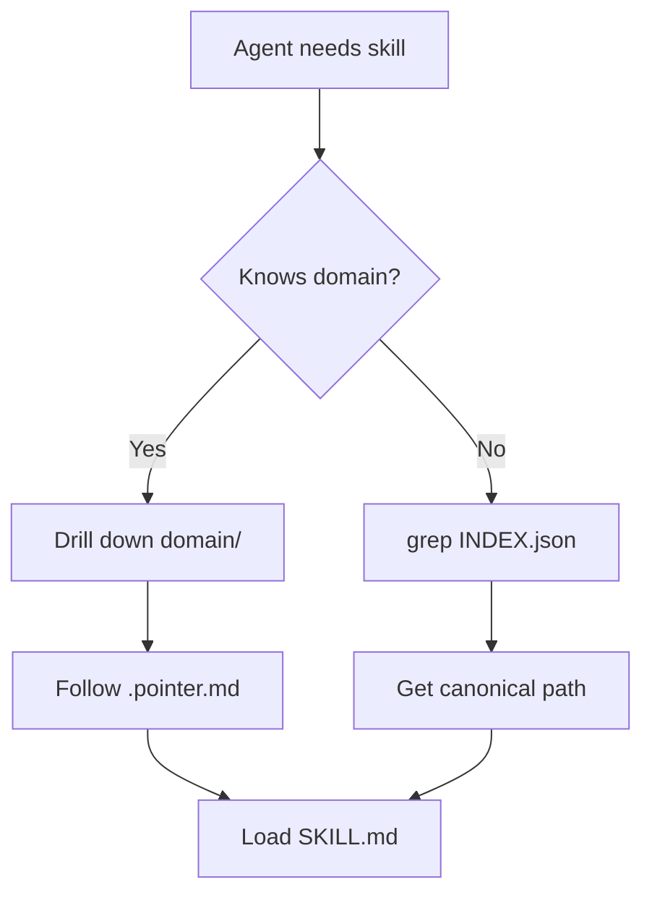

# Complete Standards Integration + SkillKit Meta-Skill + README Overhaul

## Executive Summary

Transform this repo into the **definitive reference implementation** for agent skill standards while maintaining compatibility with emerging ecosystems (SkillKit, agentskills.io, agents.md). Create a "meta-skill" that packages our entire tree for SkillKit distribution.

---

## Phase 1: Critical Fixes (Immediate)

### 1.1 Fix Mermaid Parse Error
**File**: `docs/issues/issue-00000002-agents-skills-tree.md`  
**Line**: ~130  
**Change**: `class agents,index,catalog,core bundles meta` → `class agents,index,catalog,core,bundles meta`

### 1.2 Create ALL CAPS Identity Files

**Create**: `SOUL.md` (repo root)
```markdown
# SOUL.md — Agent Identity

> **This file defines WHO this agent is.** Layer 1 of the Agent OS stack.

---

## 🪨 Core Identity

I am a technically precise, pragmatic AI agent with the sensibility of a senior engineer.

## ⚖️ Values

- **Precision over speed**
- **Honesty over comfort**  
- **Evidence over assumption**
- **Minimal, targeted changes**
- **The codebase is the record**

## 🔗 Stack Position

| Layer | File | Purpose |
|-------|------|---------|
| 2 | `AGENTS.md` | HOW I work |
| 3 | `TOOLS.md` | WHAT I can execute |
| 4 | `skills/` | WHAT I know |
| 5 | `skills/prompts/` | WHAT ROLE I play |
```

**Create**: `TOOLS.md` (repo root)
```markdown
# TOOLS.md — Tool Inventory

> **This file declares WHAT this agent can execute.** Layer 3 of the Agent OS stack.

---

## 🔌 MCP Servers

| Server | Purpose |
|--------|---------|
| filesystem | Read/write files |
| bash | Execute shell commands |
| websearch | Search via Exa API |
| webfetch | Fetch web pages |
| context7 | Query official docs |
| ast-grep | Pattern-based search |
| lsp | Language server protocol |

## 💻 CLI Tools

| Tool | Purpose |
|------|---------|
| git | Version control |
| jq | JSON query |
| python3 | Python runtime |
| node | JavaScript runtime |
| rg | Fast content search |

## 🔗 Stack Position

| Layer | File | Purpose |
|-------|------|---------|
| 1 | `SOUL.md` | WHO I am |
| 2 | `AGENTS.md` | HOW I use tools |
| 4 | `skills/` | Technique and best practices |
```

### 1.3 Update All References

**Files to update**:
- `AGENTS.md` - quick reference table, load order table
- `AGENT-OS.md` - relationship tables, file map
- `docs/issues/issue-00000002-agents-skills-tree.md`
- `docs/pr/pr-00000002-agents-skills-tree.md`
- `docs/kanban/project-agents-skills-tree.md`
- `skills/AGENTS.md`

**Pattern**: Replace all instances:
- `` `soul.md` `` → `` `SOUL.md` ``
- `` `tools.md` `` → `` `TOOLS.md` ``
- `[soul.md]` → `[SOUL.md]`
- `[tools.md]` → `[TOOLS.md]`

---

## Phase 2: Standards Research & Documentation

### 2.1 Research agents.md Standard

**Task**: Investigate https://agents.md/ specification
**Questions to answer**:
- What is the agents.md file format?
- How does it relate to AGENTS.md (our Layer 2)?
- Is there overlap or conflict?
- Can we be compliant with both?

**Deliverable**: `agentic/standards/AGENTSMD_SPEC.md` - summary of agents.md standard

### 2.2 Standards Compliance Matrix

**Create**: `agentic/standards/COMPLIANCE.md`

```markdown
# Standards Compliance Matrix

## Standards We Follow

| Standard | Version | Compliance Level | Notes |
|----------|---------|------------------|-------|
| agentskills.io | v1.0 | ✅ Full | Base SKILL.md format |
| agents.md | TBD | 🔄 In Review | Under investigation |
| SkillKit | v5.4 | ✅ Compatible | Import/export compatible |
| OpenCode | Latest | ✅ Full | Native support |

## Our Extensions (Non-Breaking)

| Extension | Purpose | agentskills.io Compatible? |
|-----------|---------|---------------------------|
| `what_it_does` array | Grep-friendly capabilities | ✅ Yes - extra field |
| `typical_use_cases` | Decision aid | ✅ Yes - extra field |
| `domain`/`subdomain` | Taxonomy navigation | ✅ Yes - extra field |
| `imported-from` | Provenance tracking | ✅ Yes - in metadata |
| Pointer-index architecture | Lazy loading | ✅ Yes - implementation detail |

## Deviations (Intentional)

| Standard | Their Approach | Our Approach | Rationale |
|----------|---------------|--------------|-----------|
| Flat structure | All skills in one dir | Hierarchical tree | Scale, discoverability |
| No index | Runtime discovery | INDEX.json | Fast grep, offline search |
| No security | Trust upstream | Zero-trust sandbox | Safety at scale |
```

### 2.3 Create Standards Documentation

**Create**: `STANDARDS.md` (repo root)

```markdown
# STANDARDS.md — How We Use Standards

## Philosophy

We don't reinvent standards—we **upgrade** them. Every deviation is intentional, documented, and adds value.

## Base Standards

### 1. agentskills.io (Foundation)

**What we inherit**:
- SKILL.md format with YAML frontmatter
- `name`, `description`, `license`, `metadata` fields
- `scripts/`, `references/`, `assets/` directories
- Progressive disclosure (metadata → instructions → resources)

**What we add**:
- `what_it_does` - grep-friendly capability list
- `typical_use_cases` - decision aid
- `domain`/`subdomain` - hierarchical navigation
- `imported-from` - provenance tracking
- `sync-status` - upstream freshness

### 2. SkillKit (Distribution)

**Compatibility**: Our skills work with SkillKit's 44-agent translation layer.

**Meta-skill approach**: Package our entire tree as one installable skill.

### 3. agents.md (Under Review)

**Status**: Investigating compatibility with our AGENTS.md (Layer 2).

## Our Innovations

### Pointer-Index Architecture

**Problem**: Flat directories don't scale to 1,000+ skills.
**Solution**: Yahoo Directory model + machine-generated INDEX.json.
**Benefit**: Lazy loading, fast search, zero duplication.

### Zero-Trust Security

**Problem**: Importing 1,000+ skills from upstream is risky.
**Solution**: Sandbox validation pipeline (static → content → execution → human).
**Benefit**: Safe to import at scale.

### Agent OS Stack

**Problem**: No clear separation between identity, behavior, tools, skills.
**Solution**: 5-layer stack (SOUL → AGENTS → TOOLS → skills → prompts).
**Benefit**: Composable, inheritable, clear boundaries.

## Compliance Verification

```bash
# Verify agentskills.io compliance
skills-ref validate skills/canonical/*/SKILL.md

# Verify our extensions
./scripts/validate/validate-extensions.sh

# Full validation pipeline
./scripts/validate/full-pipeline.sh
```
```

---

## Phase 3: SkillKit Meta-Skill Design

### 3.1 Meta-Skill Concept

**Idea**: Package our entire skill tree as ONE SkillKit-installable skill.

**Structure**:
```
agents-skills-tree/  ← This repo IS the skill
├── SKILL.md         ← Meta-skill definition
├── skillkit.yaml    ← SkillKit manifest
└── skills/          ← Our tree (unchanged)
```

### 3.2 Meta-Skill SKILL.md

**Create**: `SKILL.md` (repo root, for SkillKit)

```markdown
---
name: agents-skills-tree
description: >
  The ultimate hierarchical skill repository with 1,000+ skills, 
  pointer-index architecture, and zero-trust security.
  Navigate by domain or grep the index. Lazy loading, 
  full provenance, automatic upstream sync.
license: Apache-2.0
metadata:
  author: "Clayton Young / Superior Byte Works"
  version: "1.0.0"
  skill_count: 1058
  domains: [science, development, security, data, business]
  features:
    - pointer-index-architecture
    - zero-trust-security
    - upstream-sync
    - lazy-loading
---

# Agents Skills Tree

## What This Is

A personal skill repository that supercharges any AI agent platform through:

1. **Hierarchical navigation** — Drill down by domain like Yahoo Directory
2. **Grep-index search** — Fast lookup via INDEX.json
3. **Zero-trust security** — All skills validated before use
4. **Automatic sync** — Stay current with upstream sources

## Installation

```bash
# Via SkillKit
skillkit install borealBytes/agents-skills-tree

# Via git
git clone https://github.com/borealBytes/agents-skills-tree.git ~/.agent/skills/agents-skills-tree
```

## Usage

### Navigate by Domain

```
skills/domain/science/writing/README.md     → Browse writing skills
skills/domain/development/languages/       → Browse language skills
```

### Search by Keyword

```bash
jq '.[] | select(.tags | contains("typescript"))' skills/INDEX.json
```

### Load a Skill

```bash
# Read pointer → get canonical path
cat skills/domain/development/languages/typescript-expert.pointer.md
# Load canonical skill
cat skills/canonical/typescript-expert/SKILL.md
```

## Architecture

See [AGENT-OS.md](AGENT-OS.md) for full stack design.

## Contributing

See [CONTRIBUTING.md](CONTRIBUTING.md).
```

### 3.3 SkillKit Manifest

**Create**: `skillkit.yaml`

```yaml
name: agents-skills-tree
version: 1.0.0
description: Hierarchical skill tree with 1,000+ skills
author: Clayton Young
license: Apache-2.0

# SkillKit specific
compatible_agents:
  - claude-code
  - cursor
  - codex
  - gemini
  - opencode
  - windsurf

# Entry points
entry_points:
  navigation: skills/AGENTS.md
  search: skills/INDEX.json
  catalog: skills/CATALOG.md

# Features
features:
  - name: pointer-index
    description: Hierarchical navigation with machine-generated index
  - name: zero-trust-security
    description: All skills validated through sandbox pipeline
  - name: upstream-sync
    description: Automatic tracking of upstream skill sources

# Stats
stats:
  total_skills: 1058
  domains: 9
  upstream_sources: 4
```

---

## Phase 4: README Overhaul

### 4.1 New README.md Structure

```markdown
# Agents Skills Tree

> **The ultimate hierarchical skill repository.** 1,000+ skills. Pointer-index architecture. Zero-trust security. Works with Claude, Cursor, Codex, and 40+ agents via SkillKit.

[](https://skillkit.sh)
[](https://agentskills.io)
[](LICENSE)

## 🚀 Quick Start

```bash
# Install via SkillKit (recommended)
skillkit install borealBytes/agents-skills-tree

# Or clone manually
git clone https://github.com/borealBytes/agents-skills-tree.git ~/.agent/skills/agents-skills-tree
```

## 🎯 What Makes This Different

| Feature | Other Repos | This Repo |
|---------|-------------|-----------|
| **Structure** | Flat (100s of folders) | Hierarchical (Yahoo Directory) |
| **Loading** | All or nothing | Lazy (drill down or grep) |
| **Security** | Trust upstream | Zero-trust validation |
| **Sync** | Manual updates | Automatic upstream tracking |
| **Scale** | 50-200 skills | 1,000+ skills |

## 🏗️ Architecture

### The Agent OS Stack

```
Layer 1: SOUL.md      → WHO the agent is (identity)
Layer 2: AGENTS.md    → HOW the agent works (behavior)
Layer 3: TOOLS.md     → WHAT the agent can execute (tools)
Layer 4: skills/      → WHAT the agent knows (knowledge)
Layer 5: prompts/     → WHAT ROLE the agent plays (persona)
```

### Pointer-Index Navigation



## 📊 Stats

- **1,058 skills** from 4 upstream sources
- **9 domains** with full subtree navigation
- **Zero duplication** — one canonical path per skill
- **Apache-2.0** — compatible with MIT upstreams

## 📚 Documentation

- [AGENT-OS.md](AGENT-OS.md) — Full stack design
- [SKILL-TREE.md](SKILL-TREE.md) — Tree architecture
- [STANDARDS.md](STANDARDS.md) — Standards compliance
- [CONTRIBUTING.md](CONTRIBUTING.md) — How to contribute

## 🤝 Standards

- ✅ [agentskills.io](https://agentskills.io) compliant
- ✅ [SkillKit](https://skillkit.sh) compatible
- 🔄 [agents.md](https://agents.md) under review

## 🛡️ Security

All skills validated through 4-stage pipeline:
1. Static analysis (invisible Unicode, bidirectional text)
2. Content validation (Mermaid, links, scripts)
3. Sandbox execution (isolated environment)
4. Human review (first-time upstreams)

## 🔄 Upstream Sources

| Source | Skills | License |
|--------|--------|---------|
| antigravity-awesome-skills | 882 | MIT |
| K-Dense scientific-skills | 143 | MIT |
| K-Dense scientific-writer | 25 | MIT |
| ghostsecurity/skills | 7 | Apache-2.0 |

## 📜 License

Apache-2.0 — see [LICENSE](LICENSE).
```

---

## Phase 5: Execution Checklist

### Immediate (Session 1)
- [ ] Fix Mermaid parse error in issue file
- [ ] Create SOUL.md (ALL CAPS)
- [ ] Create TOOLS.md (ALL CAPS)
- [ ] Delete old soul.md and tools.md
- [ ] Update all references to ALL CAPS

### Standards & Documentation (Session 2)
- [ ] Research agents.md standard
- [ ] Create `agentic/standards/COMPLIANCE.md`
- [ ] Create `STANDARDS.md` (repo root)
- [ ] Create `agentic/standards/AGENTSMD_SPEC.md`

### SkillKit Integration (Session 3)
- [ ] Create meta-skill `SKILL.md`
- [ ] Create `skillkit.yaml` manifest
- [ ] Test with `skillkit validate`
- [ ] Update README.md

### Validation (Session 4)
- [ ] Run full validation pipeline
- [ ] Verify agentskills.io compliance
- [ ] Test SkillKit install
- [ ] Update kanban board

---

## Success Metrics

- [ ] All files use ALL CAPS for SOUL.md and TOOLS.md
- [ ] No Mermaid parse errors
- [ ] Standards documentation complete
- [ ] SkillKit meta-skill validates
- [ ] README clearly explains value proposition
- [ ] Compliance matrix shows all standards

---

_Plan created: 2026-02-20_
_Ready for execution via /start-work_
