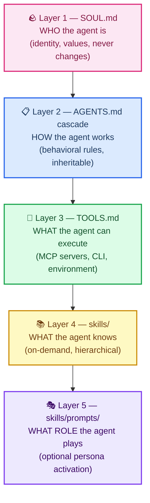
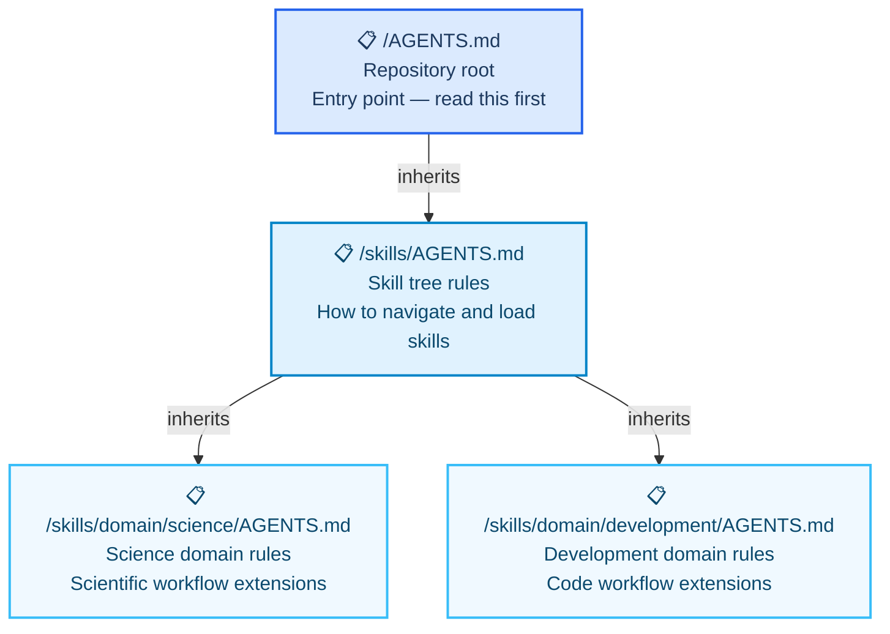
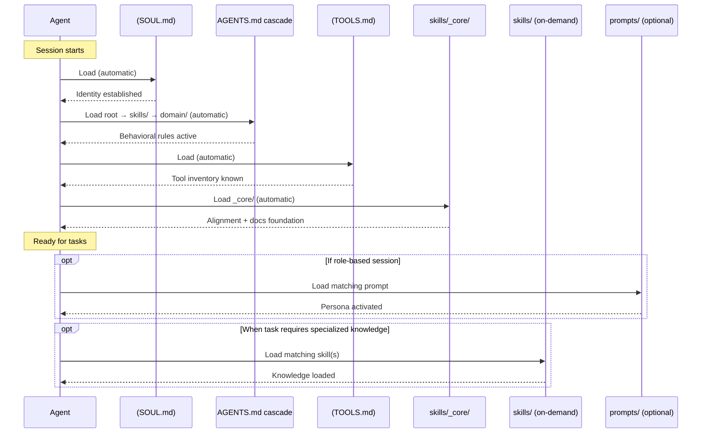

# AGENT-OS — Complete Agent Configuration Stack

> **This is the top-level design document for how all configuration layers interact.** If you are an agent reading this repo for the first time, read this after `AGENTS.md`. If you are a human designing a new agent workflow, start here.

---

## 🧭 What This Is

The **Agent OS** is a layered configuration stack that fully defines an AI agent's identity, behavior, tools, knowledge, and role. Each layer has a single responsibility and a clear relationship to the layers above and below it.



The arrow means **load order and inheritance direction**: upper layers load first and constrain lower layers. A lower layer can extend but never contradict an upper layer.

---

## 🪨 Layer 1 — SOUL.md

**What it is**: The agent's identity. Who it is, what it values, and how it thinks. Loaded unconditionally at session start, before everything else.

**What goes here**: Core values, personality traits, non-negotiable commitments, communication style, default reasoning posture.

**What does NOT go here**: Task instructions, tool declarations, skill loading rules, behavioral policies. Those belong in AGENTS.md.

**File location**: `SOUL.md` at the repository root.

**Key distinction from `_core/alignment.md`**:

| `SOUL.md` | `_core/alignment.md` |
|-----------|----------------------|
| WHO the agent is (identity) | WHAT the agent does (operational guidelines) |
| Never negotiable, never conditional | Can evolve, can be extended by subdomain AGENTS.md |
| Loaded before AGENTS.md | Loaded as part of skill initialization |
| Repo-root singleton | Part of the skill tree |
| Sets personality and values | Sets working rules and protocols |

**Template**: See [`SOUL.md`]((SOUL.md)).

---

## 📋 Layer 2 — AGENTS.md Cascade

**What it is**: Behavioral rules that govern how the agent works in this repository. Inheritable and nestable.

**What goes here**: Workflow instructions, file organization rules, commit conventions, PR protocols, style guide references, tool usage policies, task-type routing.

**What does NOT go here**: Identity (→ SOUL.md), tool availability (→ TOOLS.md), skill content (→ skills/).

### Cascade structure



**Cascade rules:**
1. Child `AGENTS.md` inherits all rules from parent
2. Child may **extend** (add new rules) but **never contradict** parent rules
3. Domain-level `AGENTS.md` files only govern behavior within their subtree
4. If no child `AGENTS.md` exists for a domain, the parent rules apply unchanged

**Currently active AGENTS.md files:**

| File | Scope | Status |
|------|-------|--------|
| `/AGENTS.md` | Whole repo | ✅ Active |
| `/skills/AGENTS.md` | Skill tree | ✅ Active |
| `/skills/domain/*/AGENTS.md` | Per-domain | ⏳ Created on demand |

---

## 🔧 Layer 3 — TOOLS.md

**What it is**: A declarative inventory of what the agent can actually execute — MCP servers, CLI tools, and environment-specific capabilities.

**What goes here**: Available MCP servers (name, URL/config, what they expose), available CLI tools (binary name, version, usage), environment-specific capabilities (OS, permissions, working directories).

**What does NOT go here**: How to use the tools skillfully (→ skills/), behavioral rules (→ AGENTS.md), identity (→ SOUL.md).

**Key distinction from skills**:

| `TOOLS.md` | Skills |
|------------|--------|
| WHAT can be executed | HOW to use it skillfully |
| Declarative inventory | Knowledge and technique |
| Environment-specific (changes by machine) | Portable (same across environments) |
| "I have access to bash" | "Here's how to write idiomatic bash" |
| Present/absent binary | Loaded/not-loaded by choice |

**File location**: `TOOLS.md` at the repository root.

**Template**: See [`TOOLS.md`]((TOOLS.md)).

---

## 📚 Layer 4 — skills/

**What it is**: On-demand knowledge. What the agent knows, loaded hierarchically as needed.

**Loading model**: Nothing in `skills/` is loaded unless explicitly requested, with the exception of `skills/_core/` which loads automatically. This is the key difference from the upper layers (soul, AGENTS, tools — always loaded) vs skills (lazy, on-demand).

**Navigation**: See [`SKILL-TREE.md`](SKILL-TREE.md) for the full loading protocol.

| Sub-layer | Always loaded | Purpose |
|-----------|--------------|---------|
| `skills/_core/` | ✅ Yes | Alignment + documentation foundation |
| `skills/canonical/<skill>/` | On demand | Actual skill knowledge |
| `skills/domain/` | On demand (navigation only) | Directory tree — pointers to canonical |
| `skills/bundles/` | On demand | Role-based ordered loading sequences |

---

## 🎭 Layer 5 — skills/prompts/

**What it is**: Optional persona activation layer. Sets WHAT ROLE the agent is playing for a session or task — separate from WHO it is ((SOUL.md)).

**What goes here**: Role activation templates (e.g., "You are a senior security researcher", "You are a technical writer focused on API documentation"). These are the prompts from prompts.chat and custom originals.

**What does NOT go here**: Skill content, behavioral rules, tool declarations.

**Key distinction from (SOUL.md)**:

| `SOUL.md` | `skills/prompts/` |
|-----------|------------------|
| Permanent identity (always active) | Temporary role (session-scoped) |
| Who you ARE | What role you're PLAYING |
| Non-negotiable | Optional, switchable |
| "I value precision and honesty" | "For this session, I'm a penetration tester" |

**Power pattern**: role prompt (persona) + skill bundle (capability) = maximum alignment for a task.

```
Example: Security audit session
1. Load prompts/custom/security-researcher.md  → sets role/mindset
2. Load bundles/security-engineer.md          → loads ordered capabilities
3. Result: agent that thinks AND acts like a senior security engineer
```

---

## 🔄 Load Order at Session Start



---

## 🗂️ File Map

```
/                           ← Repo root
├── (SOUL.md)                 ← Layer 1: Identity (WHO)
├── AGENTS.md               ← Layer 2: Behavior root (HOW)
├── (TOOLS.md)                ← Layer 3: Tool inventory (WHAT can execute)
├── SKILL-TREE.md           ← Layer 4 design doc
├── AGENT-OS.md             ← This file — full stack design
│
└── skills/                 ← Layer 4: Knowledge (WHAT it knows)
    ├── AGENTS.md           ← Layer 2: Skill tree behavioral extension
    ├── _core/              ← Always-loaded foundation
    ├── canonical/          ← All skill content (SSoT)
    ├── domain/             ← Navigation tree (pointers only)
    │   └── <domain>/
    │       └── AGENTS.md   ← Layer 2: Domain behavioral extension (on-demand)
    ├── bundles/            ← Role-based loading sequences
    └── prompts/            ← Layer 5: Persona activation (optional)
```

---

## 📐 Design Invariants

These rules never break:

1. **Upper layers load before lower layers** — soul before AGENTS.md before tools before skills
2. **Lower layers extend, never contradict** — a skill cannot override (SOUL.md) values; a domain AGENTS.md cannot contradict root AGENTS.md
3. **Skills are lazy** — nothing in `skills/canonical/` loads unless explicitly requested (except `_core/`)
4. **One canonical path per skill** — skills live in exactly one place in `canonical/`; domain tree is navigation only
5. **(TOOLS.md) is environment-specific** — it's the one layer that changes by machine; all others are portable
6. **(SOUL.md) is a singleton** — one per repo, at the root, never nested or overridden

---

## 🔗 References

- [`SOUL.md`]((SOUL.md)) — Layer 1 template
- [`AGENTS.md`](AGENTS.md) — Layer 2 root
- [`TOOLS.md`]((TOOLS.md)) — Layer 3 template
- [`SKILL-TREE.md`](SKILL-TREE.md) — Layer 4 design
- [`skills/AGENTS.md`](skills/AGENTS.md) — Layer 2 skill tree extension
- [`skills/prompts/README.md`](skills/prompts/README.md) — Layer 5 guide
- [ADR-004: Skill Tree Architecture](agentic/adr/ADR-004-skill-tree-architecture.md)

---

_Last updated: 2026-02-20_
