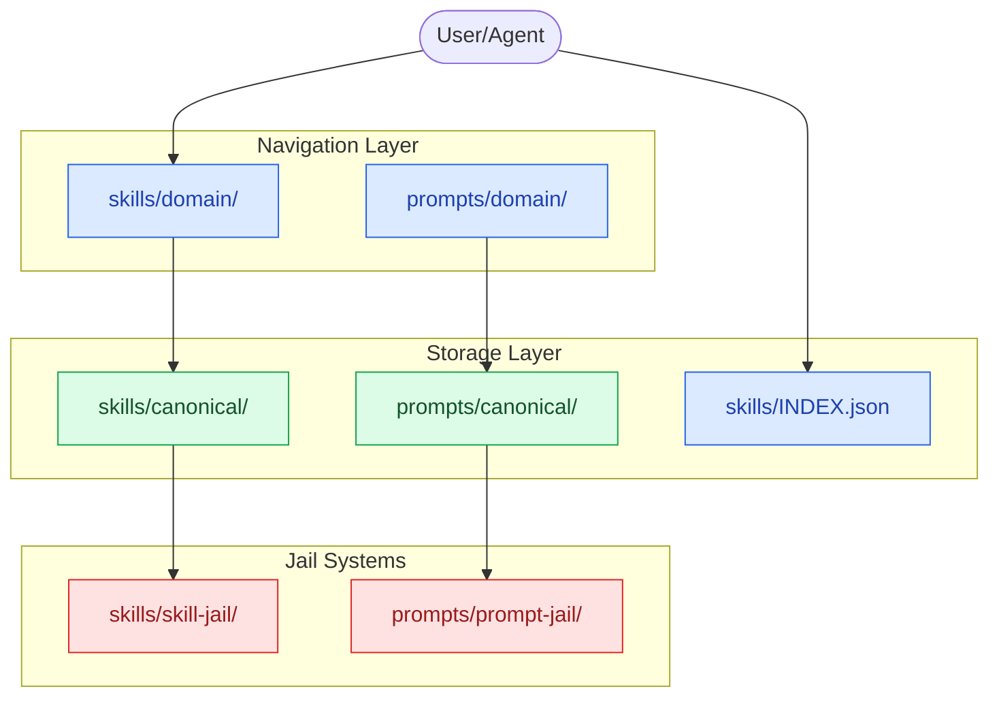
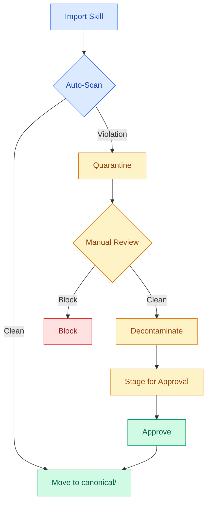

# Agent Skills Tree

> **A hierarchical skill and prompt repository with Yahoo-style navigation, automatic quarantine systems, and source-based organization.**

---

## What This Is

The Agent Skills Tree is a **personal knowledge management system** for AI agent skills and prompts. It solves the discovery problem: when you have thousands of skills, how do you find the right one?

Instead of flat folders or complex search, we use **three navigation mechanisms**:

1. **Yahoo Directory navigation** — drill down through categories
2. **Grep-index fallback** — search `INDEX.json` when uncertain
3. **Pointer-based SSoT** — every skill lives at exactly one canonical path

The system automatically **quarantines** skills and prompts with policy violations (promotional content, forced behavior), then **decontaminates** them before use.

---

## Quick Start

```bash
# Clone the repo
git clone https://github.com/SuperiorByteWorks-LLC/agent-project.git
cd agent-project

# Check out the skills branch
git checkout agents-skills-tree

# Explore the skill tree
ls skills/domain/

# Search for a skill
grep -r "debugging" skills/INDEX.json | jq '.[]'

# Import new skills (with auto-quarantine)
./scripts/import-prompts.sh --source prompts-chat --dry-run
```

---

## Architecture



---

## Directory Structure

```
.
├── skills/                    # Skill repository
│   ├── AGENTS.md             # Loading protocol for agents
│   ├── INDEX.json            # Machine-generated index (grep target)
│   ├── CATALOG.md            # Human-readable catalog
│   ├── canonical/            # SSoT location for all skills
│   │   ├── imported/         # Skills from external sources
│   │   │   └── k-dense/     # K-Dense scientific skills (decontaminated)
│   │   └── manual/          # Hand-written skills
│   ├── domain/              # Navigation tree (pointers only)
│   │   ├── science/
│   │   ├── development/
│   │   ├── security/
│   │   ├── data/
│   │   └── ...
│   ├── skill-jail/          # Quarantine system
│   │   ├── blocked/         # Permanently blocked
│   │   ├── quarantined/     # Pending cleanup
│   │   ├── cleaned/         # Ready for review
│   │   └── staged/          # Ready for promotion
│   └── bundles/             # Role-based skill sets
│
├── prompts/                 # Prompt repository (mirrors skills)
│   ├── AGENTS.md            # Prompt loading protocol
│   ├── INDEX.json           # Machine-generated index
│   ├── canonical/           # SSoT location for prompts
│   ├── domain/              # Navigation tree
│   └── prompt-jail/         # Quarantine for prompts
│
├── scripts/                 # Automation scripts
│   ├── import-prompts.sh    # Import from prompts.chat
│   ├── skill-scanner.py     # Detect violations
│   ├── prompt-scanner.py    # Detect prompt violations
│   ├── build-index.sh       # Generate INDEX.json
│   └── clean-kdense.sh      # Decontaminate K-Dense skills
│
├── docs/                    # Documentation
│   ├── standards/           # Standards documents
│   ├── kanban/             # Project boards
│   └── issues/             # Issue records
│
├── SKILL-TREE.md           # Skill tree design document
├── PROMPT-TREE.md          # Prompt tree design document
└── AGENT-OS.md             # Agent OS stack design
```

---

## Loading Protocol

### If You Know the Domain

```
skills/domain/<domain>/README.md ← read this
→ skills/domain/<domain>/<sub>/README.md ← drill down
→ skills/domain/<domain>/<sub>/<skill>.pointer.md ← get path
→ skills/canonical/<source>/<skill>/SKILL.md ← load this
```

### If You Are Uncertain

```bash
# Find by keyword
jq '.[] | select(.description | contains("debugging")) | {skill, canonical}' skills/INDEX.json

# Find by tag
jq '.[] | select(.tags[] | contains("python")) | {skill, domain}' skills/INDEX.json
```

---

## Skill Jail Workflow



---

## Key Features

### 🛡️ Automatic Quarantine

- Scans all imports for promotional content, forced behavior, tracking directives
- Moves violations to skill-jail/ for review
- Blocks critical violations permanently

### 🧹 Decontamination Pipeline

- Removes promotional sections (e.g., "Suggest Using K-Dense Web")
- Replaces corporate attribution with neutral ones
- Preserves actual skill content

### 📂 Source-Based Organization

- All imports organized by source: `canonical/imported/{source}/`
- Tracks origin and import metadata
- Enables selective updates from upstream

### 🔍 Fast Discovery

- Yahoo-style drill-down navigation
- Grep-able INDEX.json for keyword search
- SQLite database for complex queries (10K+ skills)

### 🔄 Standardized Structure

- Skills and prompts use identical patterns
- Unified jail standards
- Consistent pointer format

---

## Current Statistics

| Metric                 | Count |
| ---------------------- | ----- |
| **Skills imported**    | 1,027 |
| **Skills quarantined** | 137   |
| **Skills cleaned**     | 137   |
| **Skills blocked**     | 1     |
| **Domain pointers**    | 1,034 |
| **Skills in SQLite**   | 670+  |
| **Sample prompts**     | 1     |

---

## Usage Examples

### Import New Skills

```bash
# Dry run first
./scripts/import-prompts.sh --source prompts-chat --dry-run

# Actually import
./scripts/import-prompts.sh --source prompts-chat --limit 100
```

### Scan for Violations

```bash
# Scan specific skill
python scripts/skill-scanner.py --skill skills/canonical/some-skill/

# Scan all
python scripts/skill-scanner.py --scan-all

# Auto-quarantine
python scripts/skill-scanner.py --scan-all --auto-quarantine
```

### Decontaminate Skills

```bash
# Preview cleanup
./scripts/clean-kdense.sh --dry-run

# Apply cleanup
./scripts/clean-kdense.sh --apply
```

### Build Index

```bash
# Regenerate skill index
./scripts/build-index.sh

# Regenerate prompt index
./scripts/build-prompt-index.sh
```

---

## Design Principles

1. **Zero Duplication** — One canonical path per skill
2. **Grep-First** — INDEX.json is always the fast path
3. **Source Tracking** — Every import knows its origin
4. **Safety by Default** — Quarantine violations automatically
5. **Clean Before Use** — All skills decontaminated before promotion

---

## Related Documentation

- [SKILL-TREE.md](SKILL-TREE.md) — Complete skill tree design
- [PROMPT-TREE.md](PROMPT-TREE.md) — Prompt tree design
- [AGENT-OS.md](AGENT-OS.md) — 5-layer Agent OS stack
- [docs/standards/jail-systems.md](docs/standards/jail-systems.md) — Jail system standards
- [docs/kanban/project-agents-skills-tree.md](docs/kanban/project-agents-skills-tree.md) — Project board
- [agentic/adr/ADR-004-skill-tree-architecture.md](agentic/adr/ADR-004-skill-tree-architecture.md) — Architecture decisions

---

## License

MIT — See [LICENSE](LICENSE) for details.

---

_Last updated: 2026-02-21_
