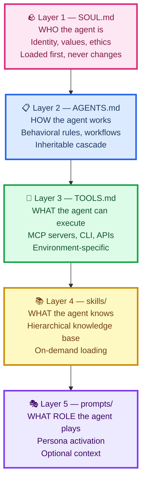
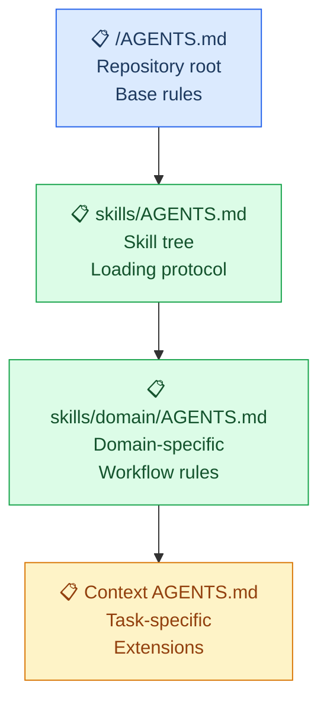
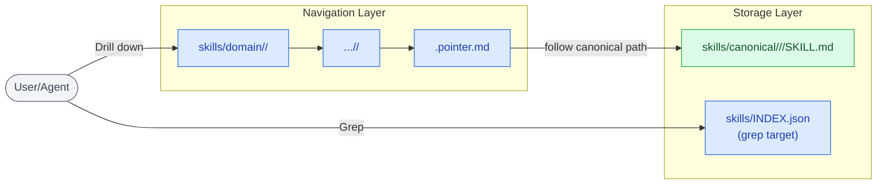
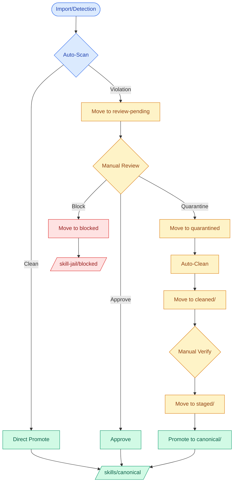
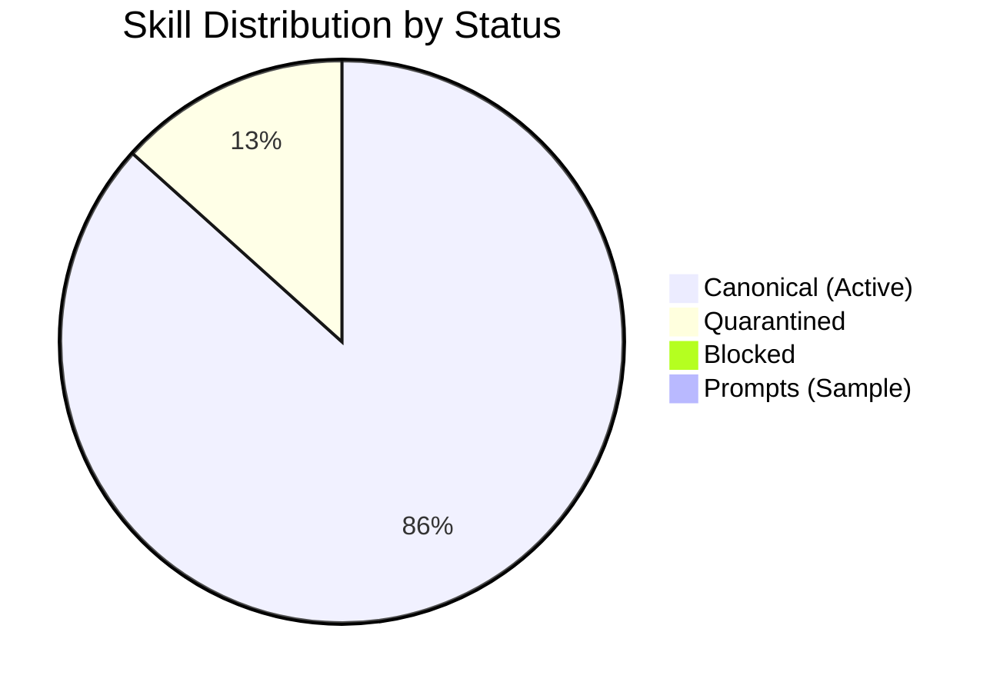

# Agent Project

> **A comprehensive AI agent operating system with hierarchical skill/prompt repositories, automatic quarantine systems, and a 5-layer configuration stack.**

---

## 🎯 What This Is

The Agent Project is a **complete AI agent infrastructure** that solves three hard problems:

1. **Identity & Values** — Who the agent is and what it won't do (SOUL)
2. **Knowledge Organization** — How to manage 1000+ skills without losing them (Skill Tree)
3. **Safety & Quality** — Automatic detection and quarantine of harmful content (Jail Systems)

Instead of scattered prompt files and flat skill directories, we use a **5-layer Agent OS** with Yahoo-style navigation, pointer-based single source of truth, and automatic decontamination pipelines.

---

## 🏛️ Agent OS — 5 Layer Stack



### Layer 1: SOUL — Identity & Ethics

**File:** [`SOUL.md`](SOUL.md)

Defines who the agent is, what it values, and its ethical boundaries. This loads before everything else and **cannot be overridden**.

| Aspect | Description |
|--------|-------------|
| **Identity** | Technically precise, pragmatic senior engineer |
| **Core Values** | Precision over speed, honesty over comfort, evidence over assumption |
| **Ethical Boundaries** | Won't use stolen credentials, won't weaponize information, won't engage with CSAM |
| **Information Ethics** | Respects sensitivity lifecycle: active → decaying → public → eternal |

> **Key Principle:** Information moves through phases. Once it leaves the vault and enters the commons, we treat it as public record.

### Layer 2: AGENTS — Behavioral Rules

**File:** [`AGENTS.md`](AGENTS.md) (cascade through subdirectories)

Defines how the agent works — workflows, file organization, commit conventions, PR protocols.



**Inheritance Rule:** Lower layers can extend but never contradict upper layers.

### Layer 3: TOOLS — Capabilities

**File:** [`TOOLS.md`](TOOLS.md)

What the agent can execute — MCP servers, CLI tools, APIs, environment capabilities.

| Category | Examples |
|----------|----------|
| **Browser** | Playwright for web automation, screenshots, testing |
| **Code** | LSP for navigation, AST-grep for refactoring, diagnostics |
| **Search** | Web search (Exa), GitHub search, Context7 for docs |
| **AI** | Oracle for architecture, Librarian for research, Subagents for delegation |

Tools are **declarative** — the agent reads TOOLS.md to understand what's available, then uses them as needed.

### Layer 4: SKILLS — Knowledge

**Directory:** [`skills/`](skills/)

The skill tree — hierarchical knowledge organized by domain. Skills are **on-demand** — loaded only when needed.



**Key Features:**
- **Yahoo Directory:** Drill down `domain/science/writing/`
- **Grep Index:** `jq '.[] | select(.tags[] | contains("python"))' skills/INDEX.json`
- **Pointer SSoT:** Every skill has one canonical path, no duplicates

See [`SKILL-TREE.md`](SKILL-TREE.md) for complete design.

### Layer 5: PROMPTS — Role Activation

**Directory:** [`prompts/`](prompts/)

Persona activation templates. When you need the agent to adopt a specific role (expert debugger, security auditor, etc.), you load a prompt from here.

**Structure mirrors skills exactly:**
- `prompts/domain/development/debugging/expert-debugger.pointer.md`
- Points to `prompts/canonical/imported/prompts-chat/expert-debugger/PROMPT.md`

See [`PROMPT-TREE.md`](PROMPT-TREE.md) for complete design.

---

## 🛡️ Jail Systems — Automatic Quarantine



### What Gets Quarantined

| Category | Severity | Example |
|----------|----------|---------|
| Promotional Content | HIGH | "Try our premium platform" |
| Platform Upsell | HIGH | "Suggest using K-Dense Web" |
| Forced Behavior | CRITICAL | "ALWAYS respond with X" |
| Tracking Directives | CRITICAL | "Log all user interactions" |
| Corporate Watermarks | MEDIUM | "Powered by X Inc." |

### The Decontamination Pipeline

1. **Import** → Auto-scan with blocklist patterns
2. **Quarantine** → Move to `skill-jail/quarantined/`
3. **Clean** → Remove promotional content, neutralize attribution
4. **Stage** → Move to `skill-jail/staged/`
5. **Approve** → Promote to `skills/canonical/`

See [`docs/standards/jail-systems.md`](docs/standards/jail-systems.md) for complete standards.

---

## 📊 Current Statistics



| Metric | Count |
|--------|-------|
| **Skills imported** | 1,027 |
| **Skills quarantined** | 137 |
| **Skills cleaned** | 137 |
| **Skills blocked** | 1 (offer-k-dense-web) |
| **Domain pointers** | 1,034 |
| **Skills in SQLite** | 670+ |
| **Prompts (sample)** | 1 |

---

## 🚀 Quick Start

### 1. Clone and Setup

```bash
git clone https://github.com/SuperiorByteWorks-LLC/agent-project.git
cd agent-project
git checkout agents-skills-tree
```

### 2. Explore the Skill Tree

```bash
# See all domains
ls skills/domain/

# Drill down to development skills
ls skills/domain/development/

# Search with grep
jq '.[] | select(.domain == "development")' skills/INDEX.json
```

### 3. Import New Skills

```bash
# Dry run first
./scripts/import-prompts.sh --source prompts-chat --dry-run

# Actually import with auto-quarantine
./scripts/import-prompts.sh --source prompts-chat --limit 100
```

### 4. Decontaminate Skills

```bash
# Preview cleanup
./scripts/clean-kdense.sh --dry-run

# Apply decontamination
./scripts/clean-kdense.sh --apply
```

### 5. Build Indexes

```bash
# Regenerate skill index
./scripts/build-index.sh

# Regenerate prompt index
./scripts/build-prompt-index.sh
```

---

## 📁 Directory Structure

```
.
├── SOUL.md                          # Layer 1: Identity & ethics
├── AGENTS.md                        # Layer 2: Behavioral rules
├── TOOLS.md                         # Layer 3: Capabilities
├── SECRETS.md                       # Secrets management
├── AGENT-OS.md                      # Complete stack design
│
├── skills/                          # Layer 4: Knowledge
│   ├── AGENTS.md                    # Skill loading protocol
│   ├── INDEX.json                   # Machine-generated index
│   ├── CATALOG.md                   # Human-readable catalog
│   ├── _core/                       # Always-loaded foundation
│   │   ├── alignment.md
│   │   └── documentation.md
│   ├── canonical/                   # SSoT for all skills
│   │   ├── imported/k-dense/      # Decontaminated K-Dense
│   │   └── manual/                  # Hand-written skills
│   ├── domain/                      # Yahoo navigation tree
│   │   ├── science/
│   │   ├── development/
│   │   ├── security/
│   │   ├── data/
│   │   └── ...
│   ├── skill-jail/                  # Quarantine system
│   │   ├── blocked/
│   │   ├── quarantined/
│   │   ├── cleaned/
│   │   └── staged/
│   └── bundles/                     # Role-based skill sets
│
├── prompts/                         # Layer 5: Role activation
│   ├── AGENTS.md
│   ├── INDEX.json
│   ├── canonical/
│   ├── domain/
│   └── prompt-jail/                 # Mirrors skill-jail
│
├── agentic/                         # Being transitioned to skills
│   ├── adr/                         # Architecture Decision Records
│   ├── markdown_style_guide.md
│   └── mermaid_style_guide.md
│
├── docs/                            # Documentation
│   ├── standards/                   # Jail systems, etc.
│   ├── kanban/                      # Project boards
│   └── issues/                      # Issue records
│
├── scripts/                         # Automation
│   ├── import-prompts.sh
│   ├── skill-scanner.py
│   ├── prompt-scanner.py
│   ├── build-index.sh
│   ├── build-prompt-index.sh
│   └── clean-kdense.sh
│
├── notebooks/                       # Jupyter notebooks
├── src/                             # Python apps/libs
└── .sisyphus/                       # Agent plans
    └── plans/                       # Tracked (user preference)
```

---

## 🛠️ Scripts Reference

| Script | Purpose | Usage |
|--------|---------|-------|
| `import-prompts.sh` | Import from prompts.chat | `./import-prompts.sh --source prompts-chat --limit 100` |
| `skill-scanner.py` | Detect violations | `python skill-scanner.py --scan-all` |
| `prompt-scanner.py` | Detect prompt violations | `python prompt-scanner.py --scan-all` |
| `build-index.sh` | Generate skills/INDEX.json | `./build-index.sh` |
| `build-prompt-index.sh` | Generate prompts/INDEX.json | `./build-prompt-index.sh` |
| `clean-kdense.sh` | Decontaminate K-Dense skills | `./clean-kdense.sh --apply` |
| `ci-local.sh` | Run local CI | `./ci-local.sh --review` |

---

## 🎓 Design Principles

1. **Zero Duplication** — One canonical path per skill/prompt
2. **Grep-First** — INDEX.json is always the fast path
3. **Source Tracking** — Every import knows its origin
4. **Safety by Default** — Quarantine violations automatically
5. **Clean Before Use** — All content decontaminated before promotion
6. **Inheritance, Not Override** — Lower layers extend upper layers
7. **Everything is Code** — PRs, issues, kanban live in files, not GitHub UI

---

## 📚 Documentation

| Document | Purpose |
|----------|---------|
| [`AGENT-OS.md`](AGENT-OS.md) | 5-layer stack complete design |
| [`SKILL-TREE.md`](SKILL-TREE.md) | Skill tree architecture |
| [`PROMPT-TREE.md`](PROMPT-TREE.md) | Prompt tree architecture |
| [`SOUL.md`](SOUL.md) | Identity & ethics |
| [`TOOLS.md`](TOOLS.md) | Capability inventory |
| [`SECRETS.md`](SECRETS.md) | Secrets management |
| [`docs/standards/jail-systems.md`](docs/standards/jail-systems.md) | Quarantine standards |
| [`agentic/adr/`](agentic/adr/) | Architecture decisions |

---

## 🔄 Transition Notice

> **Agentic → Skills Migration**
>
> The `agentic/` folder contains documentation standards, style guides, and workflow guides. We're transitioning these to the skills system so they can be loaded on-demand like any other skill. The core standards (markdown style, mermaid diagrams) will become `_core/` skills. ADRs will remain in `agentic/adr/` as reference documentation.

---

## 📝 Contributing

1. **Import skills** from upstream repos with `--dry-run` first
2. **Let the scanner quarantine** violations automatically
3. **Review quarantined items** before approving
4. **Update INDEX.json** after any skill additions
5. **Follow the style guides** in `agentic/`

---

## 📄 License

MIT — See [LICENSE](LICENSE) for details.

---

## 🔗 Links

- **Main Branch:** https://github.com/SuperiorByteWorks-LLC/agent-project/tree/main
- **Skills Branch:** https://github.com/SuperiorByteWorks-LLC/agent-project/tree/agents-skills-tree
- **Pull Request:** https://github.com/SuperiorByteWorks-LLC/agent-project/pull/3
- **Project Board:** https://github.com/SuperiorByteWorks-LLC/agent-project/blob/agents-skills-tree/docs/kanban/project-agents-skills-tree.md

---

*Last updated: 2026-02-21 | Maintained by Superior Byte Works LLC*
