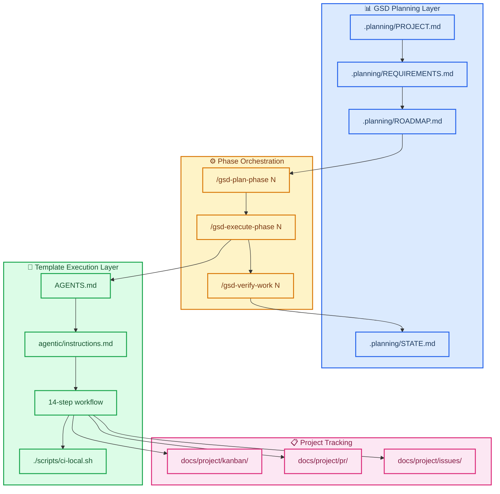

# ADR-009: GSD Integration as Project Orchestration Layer

| Field               | Value                                                      |
| ------------------- | ---------------------------------------------------------- |
| **Status**          | Accepted                                                   |
| **Date**            | 2026-02-19                                                 |
| **Decision makers** | Clayton Young                                              |
| **Consulted**       | AI agents (GSD workflow analysis and integration planning) |
| **Informed**        | All contributors and agents working in this repo           |

---

## 📋 Context

The agent-project template provides a comprehensive framework for AI-assisted development with:

- `AGENTS.md` entrypoint with 14-step transparent workflow
- "Everything is Code" project management (PRs, issues, kanban as markdown files)
- Extensive Mermaid diagram standards (23 diagram types)
- CrewAI review system with persistent memory
- Local CI runner with quality gates

However, the template lacks a structured project planning layer. GSD (Get Shit Done) provides:

- Hierarchical planning (PROJECT → REQUIREMENTS → ROADMAP)
- Phase-based execution with parallel agent orchestration
- Milestone management and audit workflows
- Research agents for domain exploration

Both systems are valuable and complementary. The question is how they should interact.

---

## 🎯 Decision

Integrate GSD as the **orchestration layer** while preserving the template's **execution framework** and **documentation standards**.

### Architecture



### Key Integration Points

1. **GSD drives what gets built** — phases, requirements, success criteria
2. **Template drives how it's built** — 14-step workflow, documentation standards, review gates
3. **Kanban boards track phase execution** — each GSD phase maps to a sprint board
4. **PR records document phase deliverables** — each phase produces one or more PRs
5. **Mermaid standards preserved** — template's 23 diagram type guides override GSD's minimal approach

### Directory Structure

```
.planning/                      # GSD planning artifacts
├── PROJECT.md                  # Project vision and context
├── REQUIREMENTS.md             # REQ-ID traceability
├── ROADMAP.md                  # Phase breakdown
├── STATE.md                    # Project memory
├── config.json                 # Workflow preferences
└── phases/                     # Phase-specific plans
    └── 01-integration-setup/
        ├── 01-01-PLAN.md
        └── 01-01-SUMMARY.md

agentic/                        # Template framework (unchanged)
├── AGENTS.md
├── instructions.md
├── markdown_style_guide.md
├── mermaid_style_guide.md
└── adr/                        # ADRs for both template and integration

docs/project/                   # Everything-is-code tracking (unchanged)
├── pr/
├── issues/
└── kanban/

.crewai/                        # Review system (unchanged)
```

---

## ⚡ Consequences

### Positive

- **Structured planning** where the template had gaps — GSD provides PROJECT/REQUIREMENTS/ROADMAP hierarchy
- **Preserved quality** — template's Mermaid and documentation standards remain authoritative
- **Unified workflow** — developers use one system: `/gsd-new-project` → `/gsd-plan-phase 1` → AGENTS.md workflow
- **Traceability** — REQ-IDs from GSD link to kanban tasks and PR records
- **Scalability** — GSD milestones and audits for long-term project health

### Negative

- **Cognitive load** — developers must understand both GSD commands and template conventions
- **Documentation overhead** — both `.planning/` and `docs/project/` need maintenance
- **Tooling complexity** — two configuration systems (`.planning/config.json` + template conventions)

### Mitigations

- Integration guide documents unified workflow patterns
- Templates updated to reference GSD phase context
- `./scripts/ci-local.sh` eventually enhanced to validate GSD phase alignment

---

## 🔄 Workflow Integration

### Starting a Project

```bash
# GSD initializes planning layer
/gsd-new-project

# Answer questions or provide PRD
# GSD creates PROJECT.md, REQUIREMENTS.md, ROADMAP.md
```

### Executing a Phase

```bash
# GSD plans the phase
/gsd-plan-phase 1

# GSD executes via parallel agents
/gsd-execute-phase 1

# Agents follow template 14-step workflow
# - Read AGENTS.md → instructions.md
# - Follow markdown/Mermaid style guides
# - Update docs/project/ tracking files
# - Run ./scripts/ci-local.sh

# GSD verifies phase completion
/gsd-verify-work 1
```

### Daily Development

```bash
# Quick task with GSD guarantees
/gsd-quick

# Or use template workflow directly for small fixes
# (following AGENTS.md instructions)
```

---

## 📚 Related Decisions

- [ADR-003: Everything is Code](./ADR-003-everything-is-code.md) — docs/project/ tracking preserved
- [ADR-007: Monorepo Foundation](./ADR-007-monorepo-foundation-and-decision-baseline.md) — baseline architecture

---

## 🔗 References

- [GSD Command Reference](../../.planning/GSD_COMMAND_REFERENCE.md) — generated guide
- [Integration Guide](../../docs/project/GSD_INTEGRATION_GUIDE.md) — comprehensive usage guide
- [.planning/PROJECT.md](../../.planning/PROJECT.md) — this integration project
- [AGENTS.md](../../AGENTS.md) — template entrypoint

---

_Last updated: 2026-02-19_
