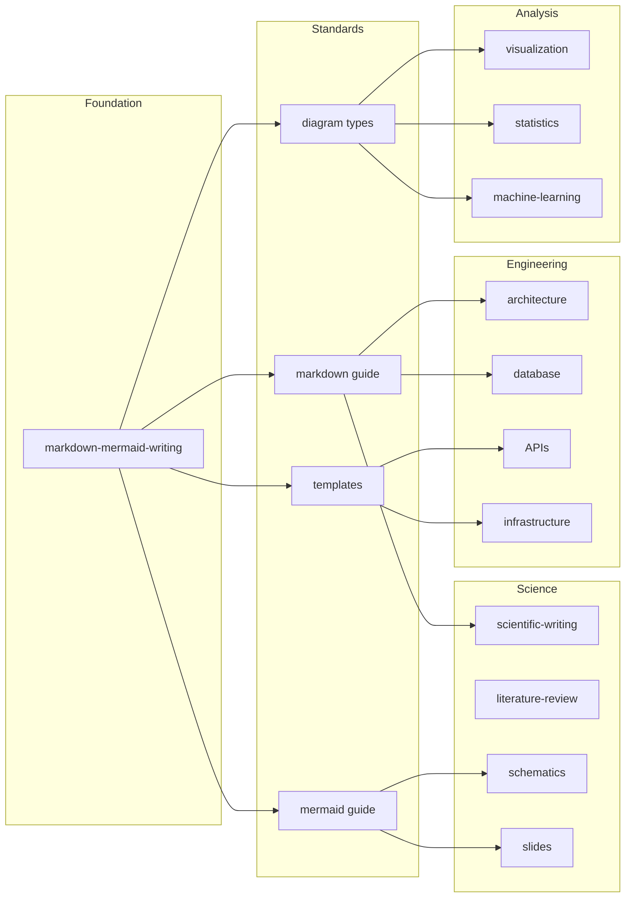

# Architecture Diagrams

Compact, left-to-right architecture diagrams optimized for GitHub rendering.

## Architecture Impact Diagram

Shows how `markdown-mermaid-writing` propagates as the foundation to all future skills.

## Key Points

- **Foundation**: Single source skill (`markdown-mermaid-writing`)
- **Standards**: Shared conventions across all domains
- **Propagation**: Every skill inherits documentation standards
- **Extensibility**: New skill categories follow established patterns

---

*Diagrams optimized for GitHub's Mermaid renderer*
