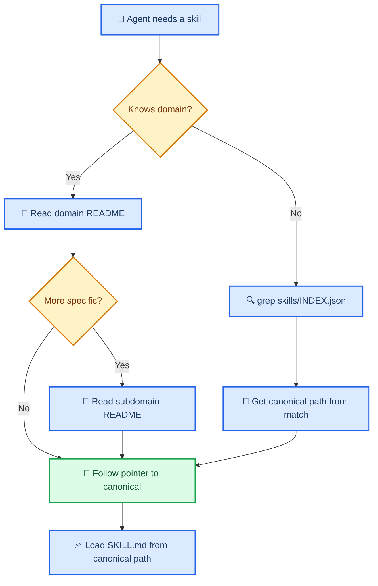
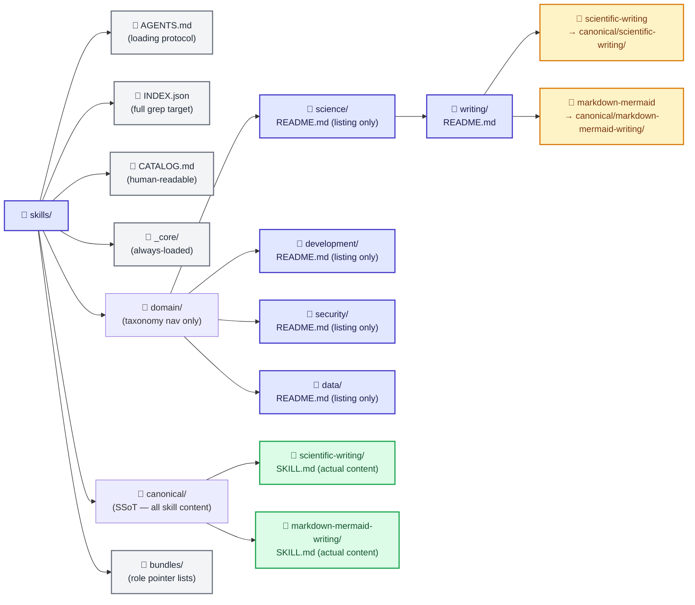

# Issue-00000002: Build Hierarchical Skill Tree with Pointer-Index Architecture

| Field              | Value                                                  |
| ------------------ | ------------------------------------------------------ |
| **Issue**          | `#2`                                                   |
| **Type**           | ✨ Feature request                                     |
| **Priority**       | P0                                                     |
| **Requester**      | Clayton Young ([@borealBytes](https://github.com/borealBytes)) |
| **Assignee**       | Human + AI agents                                      |
| **Date requested** | 2026-02-20                                             |
| **Status**         | In progress                                            |
| **Target release** | Branch `agents-skills-tree`                            |
| **Shipped in**     | [PR-#2](../pr/pr-00000002-agents-skills-tree.md) (in progress) |

---

## 📋 Summary

### Problem statement

Every major skill repository in the 2026 Claude/OpenCode ecosystem[^1][^2][^3] uses a **flat directory structure**: one folder per skill, hundreds of folders at the same level. The antigravity-awesome-skills repo has 868 skills in a single flat `skills/` directory.[^1] The K-Dense claude-scientific-skills repo has 143 skills in a flat `scientific-skills/` directory.[^2] This creates four compounding problems:

1. **Context bloat**: There is no way to load only the relevant skills without either loading everything (token expensive) or manually curating a list (brittle and human-dependent).
2. **No lazy loading**: Without hierarchy, agents cannot navigate to what they need — they must know the exact skill name or scan the entire catalog.
3. **Content duplication**: Skills that belong to multiple domains get copied, creating divergent versions with no single source of truth.
4. **No provenance or inheritance**: There is no mechanism for a sub-domain to inherit shared behavior from a parent domain, so alignment and formatting rules must be repeated in every skill.

### Proposed solution

Build a **tree-based skill system** modeled on the Yahoo Directory[^4] paradigm — agents drill down through a hierarchy of README-based "directory pages" until they reach what they need. When uncertain, they grep a single root-level `INDEX.json` that contains the complete catalog.

Three invariants drive the entire design:

- **One canonical path per skill** — skills live in exactly one location under `skills/canonical/`. No copies, no mirrors.
- **Pointers everywhere else** — taxonomy nodes (domain, subdomain) contain only description + path references, never skill content.
- **Index-first search** — `skills/INDEX.json` is the grep target for fast lookup; it is machine-generated from canonical sources and never edited by hand.

### User story

> As an **AI agent working on any project**, I want to **navigate a skill hierarchy like a directory tree or grep a single index**, so that **I load only the context I need, from a single authoritative source, without duplicating anything**.

---

## 🎯 Acceptance Criteria

The feature is complete when:

- [ ] Skills live at exactly one canonical path under `skills/canonical/`; no duplicate content exists
- [ ] Every taxonomy node (`skills/domain/*/README.md`) is a directory listing with human-readable descriptions and pointer paths only — no skill content
- [ ] `skills/INDEX.json` is machine-generated and contains every skill's name, description, tags, canonical path, and source attribution
- [ ] `skills/AGENTS.md` explains the loading protocol: drill-down for known categories, grep-index for uncertain location
- [ ] At minimum three domain subtrees are populated: `science/`, `development/`, `security/`
- [ ] Bundle files exist for at least three roles and consist only of ordered skill pointer lists (no content)
- [ ] Skills imported from upstream repos retain original license and attribution in their canonical SKILL.md frontmatter
- [ ] The `_core/` directory contains always-loaded alignment and formatting foundation skills
- [ ] A `CATALOG.md` provides a human-readable version of the full index, organized by domain

---

## 📐 Design

### Skill tree navigation flow



### Directory structure



### Pointer file format

Pointer files are the taxonomy leaves — they describe a skill and reference its canonical path. They contain zero skill content.

```yaml
# skills/domain/science/writing/scientific-writing.pointer.md
---
skill: scientific-writing
canonical: ../../../canonical/scientific-writing/SKILL.md
description: >
  Write scientific manuscripts in full paragraphs using IMRAD structure,
  citations, figures, and reporting guidelines (CONSORT/STROBE/PRISMA).
tags: [science, writing, manuscripts, citations]
upstream: https://github.com/K-Dense-AI/claude-scientific-skills
---
```

### INDEX.json entry format

```json
{
  "skill": "scientific-writing",
  "canonical": "skills/canonical/scientific-writing/SKILL.md",
  "description": "Write scientific manuscripts in full paragraphs...",
  "tags": ["science", "writing", "manuscripts", "citations"],
  "domain": ["science/writing"],
  "bundles": ["scientist", "researcher"],
  "upstream": "https://github.com/K-Dense-AI/claude-scientific-skills",
  "license": "MIT",
  "load_frequency": "high"
}
```

### Technical considerations

- **Pointer resolution**: Agents follow the `canonical` path in pointer files using relative paths. No symlinks required — plain text references work in all environments.
- **Index generation**: `scripts/build-index.sh` walks `skills/canonical/`, reads each `SKILL.md` frontmatter, and regenerates `INDEX.json`. Run after any skill addition.
- **Inheritance via `_core/`**: Core skills (alignment, documentation standards) are always loaded first. Domain-level `AGENTS.md` files extend the root with domain-specific loading rules.
- **Upstream attribution**: Every imported skill retains its original `license`, `upstream`, and attribution in YAML frontmatter. Apache-2.0 and MIT are compatible for derivative works per the opencode repo license.[^5]

<details>
<summary><strong>📋 Upstream repos and import plan</strong></summary>

| Repo | Skills | License | Import priority | Notes |
|------|--------|---------|-----------------|-------|
| K-Dense-AI/claude-scientific-skills[^2] | 143 | MIT | High | Already local at `~/dev/claude-scientific-skills` |
| sickn33/antigravity-awesome-skills[^1] | 868 | MIT | High (curated) | Import top ~50 by domain; not all 868 |
| ghostsecurity/skills[^3] | 7 | Apache-2.0 | Medium | AppSec domain, high quality |
| K-Dense-AI/agentic-data-scientist[^6] | TBD | TBD | Medium | Data science domain |
| K-Dense-AI/claude-scientific-writer[^7] | TBD | TBD | Medium | Writing domain supplement |

</details>

---

## 📊 Impact

| Dimension           | Assessment                                                        |
| ------------------- | ----------------------------------------------------------------- |
| **Users affected**  | Any agent working on any project using this skill repo            |
| **Revenue impact**  | Indirect — faster, more accurate agent work across all projects   |
| **Effort estimate** | L (architecture + import pipeline + initial tree population)      |
| **Dependencies**    | Upstream skill repos, opencode.ai skill loading spec[^8]          |

### Success metrics

- **Context efficiency**: A scientist-mode agent loads ≤ 8 skills vs ≥ 50 when all science skills loaded flat
- **Zero duplication**: `find skills/ -name "SKILL.md" | wc -l` equals `jq '. | length' skills/INDEX.json`
- **Index coverage**: Every canonical skill appears in `INDEX.json` within 1 second of grep

---

## 🔗 References

[^1]: antigravity-awesome-skills — 868 skills, MIT, flat `skills/` structure: https://github.com/sickn33/antigravity-awesome-skills
[^2]: K-Dense claude-scientific-skills — 143 skills, MIT, flat `scientific-skills/` structure: https://github.com/K-Dense-AI/claude-scientific-skills
[^3]: ghostsecurity/skills — 7 AppSec skills, Apache-2.0: https://github.com/ghostsecurity/skills
[^4]: Yahoo Directory model — hierarchical drill-down navigation: https://en.wikipedia.org/wiki/Yahoo!_Directory
[^5]: Apache-2.0 and MIT compatibility: https://www.apache.org/legal/resolved.html#category-a
[^6]: K-Dense agentic-data-scientist: https://github.com/K-Dense-AI/agentic-data-scientist
[^7]: K-Dense claude-scientific-writer: https://github.com/K-Dense-AI/claude-scientific-writer
[^8]: OpenCode skills documentation: https://opencode.ai/docs/skills/

- [PR-#2](../pr/pr-00000002-agents-skills-tree.md) — Implementation PR
- [Project kanban](../kanban/project-agents-skills-tree.md)
- [ADR-004: Skill Tree Architecture](../../agentic/adr/ADR-004-skill-tree-architecture.md)
- [SKILL-TREE.md — Full Design Document](../../SKILL-TREE.md)

---

_Last updated: 2026-02-20_
