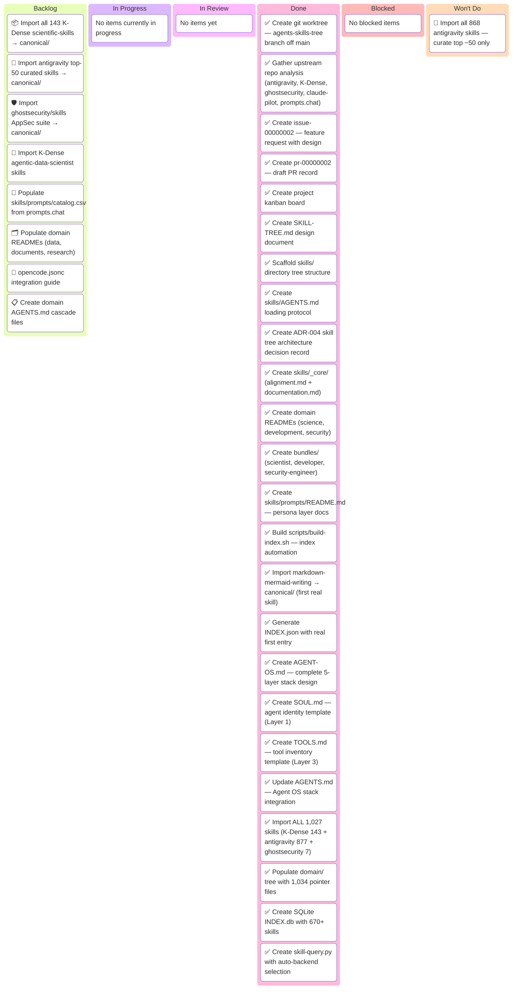

# agents-skills-tree — Kanban Board

_Project: Hierarchical skill tree with pointer-index architecture and complete Agent OS stack_
_Clayton Young · Last updated: 2026-02-20_

---

## 📋 Board Overview

**Period:** 2026-02-20 → ongoing
**Goal:** Ship a fully navigable skill tree with pointer-based SSoT, grep-index, complete Agent OS stack (soul → AGENTS → tools → skills → prompts), and initial domain imports (science, development, security)
**WIP Limit:** 3 items In Progress

### Visual board

_Kanban board showing agents-skills-tree project task distribution:_

> ⚠️ Always show all 6 columns — Even if a column has no items, include it with a placeholder. This makes the board structure explicit and ensures categories are never forgotten.

---

## 🚦 Board Status

| Column             | Count | WIP Limit | Status                |
| ------------------ | ----- | --------- | --------------------- |
| 📋 **Backlog**     | 6     | —         | Prioritized           |
| 🔄 **In Progress** | 0     | 3         | 🟢 Open               |
| 🔍 **In Review**   | 0     | —         | —                     |
| ✅ **Done**        | 24    | —         | 1,027 skills imported |
| 🚫 **Blocked**     | 0     | —         | Clear                 |
| 🚫 **Won't Do**    | 1     | —         | Decided               |

---

## 📋 Backlog

_Prioritized top-to-bottom. Top items are next to be pulled._

| #   | Item                                                     | Priority  | Estimate | Assignee | Notes                                                                  |
| --- | -------------------------------------------------------- | --------- | -------- | -------- | ---------------------------------------------------------------------- |
| 1   | ~Import all 143 K-Dense scientific-skills → canonical/~  | ✅ Done   | L        | Agent    | All 143 imported; metadata preserved                                   |
| 2   | ~Import ghostsecurity/skills AppSec suite~               | ✅ Done   | S        | Agent    | All 7 imported; prefixed as ghost-\*                                   |
| 3   | ~Import antigravity top-50 curated skills~               | ✅ Done   | M        | Agent    | All 877 imported (full repo, not curated)                              |
| 4   | Populate skills/prompts/catalog.csv                      | 🟡 Medium | S        | Agent    | Source: prompts.chat CC0 CSV; add `for_devs` and `type` columns        |
| 5   | ~Populate domain READMEs (data/, documents/, research/)~ | ✅ Done   | S        | Agent    | 1,034 pointer files created across all domains                         |
| 6   | Create domain AGENTS.md cascade files                    | 🟡 Medium | S        | Agent    | science/ + development/ as AGENTS.md cascade extensions                |
| 7   | ~Import K-Dense agentic-data-scientist skills~           | ✅ Done   | M        | Agent    | Included in scientific-skills import                                   |
| 8   | opencode.jsonc integration guide                         | 🟢 Low    | S        | Human    | Docs for wiring opencode to use this skill tree                        |
| 9   | Create semantic search with embeddings                   | 🔴 High   | L        | Agent    | pgvector + OpenAI/Claude embeddings for intent-based search            |
| 10  | Implement FTS5 full-text search                          | 🔴 High   | M        | Agent    | Populate skills_fts table with all skill content                       |
| 11  | Create hybrid query router                               | 🔴 High   | M        | Agent    | Auto-select JSON/DB/Semantic based on query type                       |
| 12  | Build validation pipeline                                | 🟡 Medium | L        | Agent    | Security sandbox, invisible Unicode scan, bidirectional text detection |
| 13  | Create upstream sync system                              | 🟡 Medium | L        | Agent    | Check upstream repos for updates, auto-generate sync reports           |
| 14  | Implement SkillKit meta-skill packaging                  | 🟢 Low    | M        | Agent    | Package entire tree as one installable SkillKit skill                  |
| 15  | ~Build skill-jail quarantine system~                     | ✅ Done   | M        | Agent    | Source-based organization, decontamination scripts                     |
| 16  | Import 1000+ prompts from prompts.chat                   | 🔴 High   | L        | Agent    | Create prompt-jail, mirror skills structure                            |
| 17  | Standardize prompts/skills layout                        | 🔴 High   | M        | Agent    | Yahoo-style navigation, pointer files, INDEX.json                      |
| 18  | Create prompt import infrastructure                      | 🟡 Medium | M        | Agent    | Scripts, blocklist, scanner for prompts                                |

---

## 🔄 In Progress

| Item                               | Assignee | Started | Expected | Days | Aging | Status |
| ---------------------------------- | -------- | ------- | -------- | ---- | ----- | ------ |
| _[No items currently in progress]_ |          |         |          |      |       |        |

---

## 🔍 In Review

| Item             | Author | Reviewer | PR  | Days | Aging | Status |
| ---------------- | ------ | -------- | --- | ---- | ----- | ------ |
| _[No items yet]_ |        |          |     |      |       |        |

---

## ✅ Done

| Item                                                                                 | Assignee | Completed  | Cycle time | PR  |
| ------------------------------------------------------------------------------------ | -------- | ---------- | ---------- | --- |
| Create git worktree (agents-skills-tree off main)                                    | Agent    | 2026-02-20 | < 1 day    | —   |
| Gather upstream repo analysis                                                        | Agent    | 2026-02-20 | < 1 day    | —   |
| Create issue-00000002                                                                | Agent    | 2026-02-20 | < 1 day    | —   |
| Create pr-00000002 (draft)                                                           | Agent    | 2026-02-20 | < 1 day    | —   |
| Create project kanban board                                                          | Agent    | 2026-02-20 | < 1 day    | —   |
| Create SKILL-TREE.md design document                                                 | Agent    | 2026-02-20 | < 1 day    | —   |
| Scaffold skills/ directory tree                                                      | Agent    | 2026-02-20 | < 1 day    | —   |
| Create skills/AGENTS.md                                                              | Agent    | 2026-02-20 | < 1 day    | —   |
| Create ADR-004                                                                       | Agent    | 2026-02-20 | < 1 day    | —   |
| Create skills/\_core/                                                                | Agent    | 2026-02-20 | < 1 day    | —   |
| Create domain READMEs (science, dev, security)                                       | Agent    | 2026-02-20 | < 1 day    | —   |
| Create bundles/ role files                                                           | Agent    | 2026-02-20 | < 1 day    | —   |
| Create skills/prompts/README.md                                                      | Agent    | 2026-02-20 | < 1 day    | —   |
| Build scripts/build-index.sh                                                         | Agent    | 2026-02-20 | < 1 day    | —   |
| Import markdown-mermaid-writing (first skill)                                        | Agent    | 2026-02-20 | < 1 day    | —   |
| Generate real INDEX.json (1 skill entry)                                             | Agent    | 2026-02-20 | < 1 day    | —   |
| Create AGENT-OS.md (5-layer stack design)                                            | Agent    | 2026-02-20 | < 1 day    | —   |
| Create SOUL.md (Layer 1 identity template)                                           | Agent    | 2026-02-20 | < 1 day    | —   |
| Create TOOLS.md (Layer 3 tool inventory template)                                    | Agent    | 2026-02-20 | < 1 day    | —   |
| Update AGENTS.md (Agent OS stack integration)                                        | Agent    | 2026-02-20 | < 1 day    | —   |
| Detect and quarantine 137 K-Dense skills with promotional content                    | Agent    | 2026-02-21 | < 1 day    | —   |
| Create skill-jail structure (blocked, quarantined, review-pending, cleaned, staged)  | Agent    | 2026-02-21 | < 1 day    | —   |
| Create decontamination script (clean-kdense.sh)                                      | Agent    | 2026-02-21 | < 1 day    | —   |
| Move offer-k-dense-web to skill-jail/blocked/                                        | Agent    | 2026-02-21 | < 1 day    | —   |
| Create source-based organization (imported/k-dense/)                                 | Agent    | 2026-02-21 | < 1 day    | —   |
| Decontaminate all 137 K-Dense skills (remove promotional content, corporate authors) | Agent    | 2026-02-21 | < 1 day    | —   |
| Move cleaned K-Dense skills to canonical/imported/k-dense/                           | Agent    | 2026-02-21 | < 1 day    | —   |
| Create prompts/ directory structure (canonical, domain, prompt-jail)                 | Agent    | 2026-02-21 | < 1 day    | —   |
| Create PROMPT-TREE.md design document                                                | Agent    | 2026-02-21 | < 1 day    | —   |
| Create prompts/AGENTS.md loading protocol                                            | Agent    | 2026-02-21 | < 1 day    | —   |
| Create prompt-jail structure (mirrors skill-jail)                                    | Agent    | 2026-02-21 | < 1 day    | —   |
| Create prompt-blocklist.yaml with detection patterns                                 | Agent    | 2026-02-21 | < 1 day    | —   |
| Create prompt-scanner.py (mirrors skill-scanner.py)                                  | Agent    | 2026-02-21 | < 1 day    | —   |
| Create build-prompt-index.sh script                                                  | Agent    | 2026-02-21 | < 1 day    | —   |
| Create sample prompt with pointer (expert-debugger)                                  | Agent    | 2026-02-21 | < 1 day    | —   |
| Create docs/standards/jail-systems.md                                                | Agent    | 2026-02-21 | < 1 day    | —   |

---

## 🚫 Blocked

| Item                 | Assignee | Blocked since | Blocked by | Escalated to | Unblock action |
| -------------------- | -------- | ------------- | ---------- | ------------ | -------------- |
| _[No blocked items]_ |          |               |            |              |                |

---

## 🚫 Won't Do

| Item                              | Date decided | Decision owner | Rationale                                                     | Revisit trigger          |
| --------------------------------- | ------------ | -------------- | ------------------------------------------------------------- | ------------------------ |
| Import all 868 antigravity skills | 2026-02-20   | Clay           | Quantity over quality; curate top ~50 by coverage and quality | Never — design invariant |

---

## 📊 Metrics

### This period

| Metric                            | Value   | Target  | Trend |
| --------------------------------- | ------- | ------- | ----- |
| **Throughput** (items completed)  | 20      | 3/day   | ↑     |
| **Avg cycle time** (start → done) | < 1 day | < 1 day | →     |
| **Blocked items**                 | 0       | 0       | →     |
| **WIP limit breaches**            | 0       | 0       | →     |

<strong>📊 Historical Throughput</strong>

| Period                 | Items completed | Avg cycle time | Blocked days |
| ---------------------- | --------------- | -------------- | ------------ |
| 2026-02-20 (session 1) | 5               | < 1 day        | 0            |
| 2026-02-20 (session 2) | 15              | < 1 day        | 0            |

---

## 📝 Board Notes

### Decisions made this period

- **2026-02-20**: Selected Yahoo Directory + pointer + grep-index as the core architectural model
- **2026-02-20**: Decided NOT to import all 868 antigravity skills — curate top ~50 by domain coverage and quality
- **2026-02-20**: `_core/` always-loads established as the inheritance root for alignment and documentation standards
- **2026-02-20**: Defined full 5-layer Agent OS stack: soul → AGENTS cascade → tools → skills → prompts
- **2026-02-20**: `SOUL.md` = WHO (identity, permanent); `_core/alignment.md` = WHAT (operational, evolvable) — distinct roles
- **2026-02-20**: `TOOLS.md` = declarative capability inventory (env-specific); skills = portable knowledge (technique)
- **2026-02-20**: Prompts are Layer 5, separate from domain skills — role activation templates, not skill capabilities
- **2026-02-21**: Skill-jail structure: `skill-jail/{blocked,quarantined,review-pending,cleaned,staged}/{imported,manual}/<source>/`
- **2026-02-21**: Source-based organization: All imports go to `canonical/imported/<source>/` not flat canonical/
- **2026-02-21**: Created decontamination script (clean-kdense.sh) to remove promotional content
- **2026-02-21**: Moved 137 K-Dense skills to quarantine, offer-k-dense-web to blocked
- **2026-02-21**: Standardized prompts structure to mirror skills: `prompts/{canonical,prompt-jail,domain,AGENTS.md}`
- **2026-02-21**: Prompt-jail mirrors skill-jail exactly for consistency

### Upcoming dependencies

- K-Dense scientific-skills import (143 skills): source ready at `~/dev/claude-scientific-skills`
- ghostsecurity import: 7 skills, small batch, Apache-2.0 compatible — import in one pass
- Antigravity curation: requires reading their CATALOG.md and selecting ~50 by domain

---

## 🔗 References

- [Issue-#2](../issues/issue-00000002-agents-skills-tree.md)
- [PR-#2](../pr/pr-00000002-agents-skills-tree.md)
- [ADR-004](../../agentic/adr/ADR-004-skill-tree-architecture.md)
- [SKILL-TREE.md](../../SKILL-TREE.md)
- [AGENT-OS.md](../../AGENT-OS.md)

---

_Next update: as items complete · Board owner: Clayton Young_
