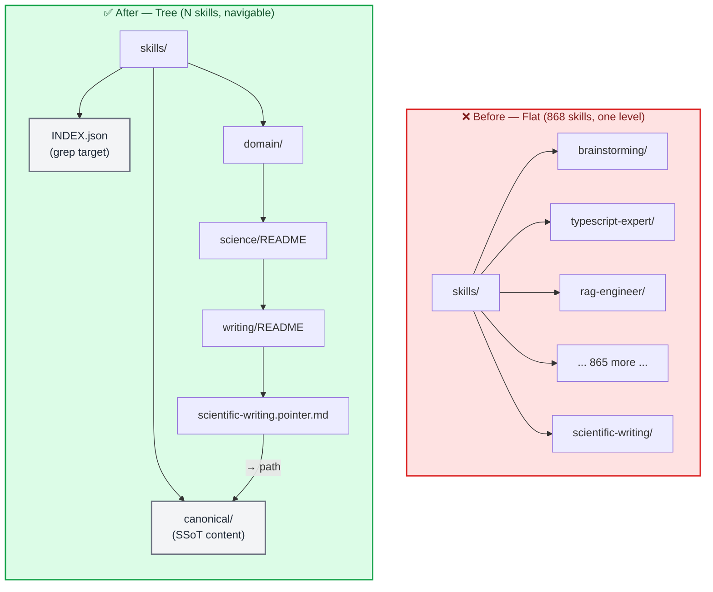

# PR-00000002: feat(skills): build hierarchical skill tree with pointer-index architecture

| Field               | Value                                                                  |
| ------------------- | ---------------------------------------------------------------------- |
| **PR**              | `#2` — Draft                                                           |
| **Author**          | Clayton Young ([@borealBytes](https://github.com/borealBytes))         |
| **Date**            | 2026-02-20                                                             |
| **Status**          | Open — Draft                                                           |
| **Branch**          | `agents-skills-tree` → `main`                                          |
| **Related issues**  | [#2](../issues/issue-00000002-agents-skills-tree.md)                   |
| **Kanban board**    | [project-agents-skills-tree](../kanban/project-agents-skills-tree.md)  |
| **Deploy strategy** | Standard — documentation and skill files only, no runtime code changes |

---

## 📋 Summary

### What changed and why

This PR establishes the `agents-skills-tree` project: a hierarchical, pointer-indexed skill repository designed to replace flat skill directories with a Yahoo-Directory-style tree where agents drill down by domain or grep a single root-level index. All 868+ skills from referenced upstream repos[^1][^2][^3] are importable, but each lives at exactly one canonical path — no copies, no duplication.

The core insight driving the design: skill loading is a **navigation problem**, not a search problem. When an agent knows it needs a science writing skill, it should read `skills/domain/science/writing/README.md` (a one-page directory listing) and follow a pointer to the canonical file. When it doesn't know the domain, it greps `skills/INDEX.json` — a machine-generated registry searchable in milliseconds. Neither path requires loading content from more than one skill at a time.

Three invariants that are never violated: (1) one canonical path per skill, (2) taxonomy nodes contain pointers only — never skill content, (3) `INDEX.json` is the grep-first fallback and is always machine-generated.

### Impact classification

| Dimension         | Level             | Notes                                                      |
| ----------------- | ----------------- | ---------------------------------------------------------- |
| **Risk**          | 🟢 Low            | New files only — no existing files modified                |
| **Scope**         | Broad             | New `skills/` tree and associated agentic/design documents |
| **Reversibility** | Easily reversible | Delete `skills/` directory to fully revert                 |
| **Security**      | None              | Documentation and skill markdown files only                |

---

## 🔍 Changes

### Change inventory

| File / Area                                        | Change type | Description                                                                                  |
| -------------------------------------------------- | ----------- | -------------------------------------------------------------------------------------------- |
| `docs/issues/issue-00000002-agents-skills-tree.md` | Added       | Feature request with full design, acceptance criteria, pointer format spec                   |
| `docs/pr/pr-00000002-agents-skills-tree.md`        | Added       | This PR record                                                                               |
| `docs/kanban/project-agents-skills-tree.md`        | Added       | Project kanban board                                                                         |
| `agentic/adr/ADR-004-skill-tree-architecture.md`   | Added       | Architecture decision record for the pointer-index pattern                                   |
| `SKILL-TREE.md`                                    | Added       | Complete design document — loading protocol, pointer format, index schema, inheritance model |
| `skills/AGENTS.md`                                 | Added       | Root skill loading guide for agents — explains drill-down and grep-index paths               |
| `skills/INDEX.json`                                | Added       | Machine-readable skill registry (initially empty template, populated as skills are imported) |
| `skills/CATALOG.md`                                | Added       | Human-readable catalog organized by domain                                                   |
| `skills/canonical/`                                | Added       | SSoT location for all skill content                                                          |
| `skills/domain/`                                   | Added       | Taxonomy navigation tree (pointers + READMEs only)                                           |
| `skills/_core/`                                    | Added       | Always-loaded foundation skills (alignment, documentation)                                   |
| `skills/bundles/`                                  | Added       | Role-based skill pointer bundles                                                             |
| `scripts/build-index.sh`                           | Added       | Script to regenerate INDEX.json from canonical/ frontmatter                                  |
| `scripts/build-db.py`                              | Added       | SQLite database generator for fast queries (10K+ skills)                                     |
| `scripts/skill-query.py`                           | Added       | Hybrid query tool — auto-selects JSON (<1K) or DB (≥1K)                                      |
| `scripts/populate-domain-pointers.py`              | Added       | Auto-generate domain/ pointers from canonical/                                               |
| `skills/canonical/`                                | Modified    | **1,027 skills imported** from K-Dense (143) + antigravity (877) + ghostsecurity (7)         |
| `skills/domain/`                                   | Modified    | **1,034 pointer files** auto-populated across all domains                                    |
| `docs/diagrams/`                                   | Added       | Architecture diagrams (compact LR layout, user journey, git graph)                           |
| `skills/skill-jail/`                               | Added       | Quarantine system for skills with policy violations                                          |
| `skills/skill-jail/quarantined/`                   | Added       | **137 K-Dense skills quarantined** for promotional content                                   |
| `skills/skill-jail/blocked/`                       | Added       | **1 skill blocked** (offer-k-dense-web) — purely promotional                                 |
| `skills/skill-jail/cleaned/`                       | Added       | Decontaminated skills ready for reintegration                                                |
| `skills/skill-jail/staged/`                        | Added       | Skills staged for promotion to canonical                                                     |
| `scripts/clean-kdense.sh`                          | Added       | Decontamination script — removes promotional content                                         |
| `scripts/decontaminate-skills.py`                  | Added       | Python decontamination tool with auto-staging                                                |
| `skills/canonical/imported/`                       | Added       | Source-based organization: `canonical/imported/<source>/`                                    |
| `prompts/`                                         | Added       | Complete prompts infrastructure (mirrors skills)                                             |
| `prompts/prompt-jail/`                             | Added       | Quarantine system for prompts (mirrors skill-jail)                                           |
| `prompts/canonical/`                               | Added       | Canonical prompt storage with source-based organization                                      |
| `prompts/domain/`                                  | Added       | Yahoo-style navigation for prompts                                                           |
| `PROMPT-TREE.md`                                   | Added       | Design document for prompts architecture                                                     |
| `scripts/import-prompts.sh`                        | Added       | Import script for prompts.chat integration                                                   |

### Before and after

**Before:**

```
skills/ (flat — antigravity-awesome-skills pattern)
├── brainstorming/SKILL.md
├── typescript-expert/SKILL.md
├── react-patterns/SKILL.md
├── rag-engineer/SKILL.md
├── ... (865 more)
```

**After:**

```
skills/
├── AGENTS.md              ← loading protocol
├── INDEX.json             ← grep target (machine-generated)
├── CATALOG.md             ← human-readable index
├── _core/                 ← always-loaded (alignment, docs)
├── canonical/             ← SSoT for all skill content
│   ├── scientific-writing/SKILL.md
│   ├── brainstorming/SKILL.md
│   └── ...
├── domain/
│   ├── science/
│   │   ├── README.md      ← directory listing (pointers only)
│   │   └── writing/
│   │       ├── README.md
│   │       └── scientific-writing.pointer.md
│   └── development/
│       ├── README.md
│       └── typescript/
│           ├── README.md
│           └── typescript-expert.pointer.md
└── bundles/
    └── scientist.md       ← ordered pointer list, no content
```

### Architecture impact



<details>
<summary><strong>📋 Design Decisions in Detail</strong></summary>

**Why plain-text pointers over symlinks:**
Symlinks require `core.symlinks=true` on Windows and can confuse some agents. Plain-text `.pointer.md` files are readable, grep-able, and unambiguous. The `canonical` path in the frontmatter is the only pointer mechanism needed.

**Why machine-generated INDEX.json:**
Any hand-edited index drifts from reality within days. The `build-index.sh` script reads frontmatter from every `canonical/*/SKILL.md` and regenerates the index atomically. This is the only correct source of truth for "does skill X exist?"

**Why domain/ has no skill content:**
If domain taxonomy nodes contained skill content (even excerpts), agents would be tempted to use that content directly — breaking SSoT. All domain nodes are navigation aids only. The discipline of "pointers only in domain/" is enforced by linting in `scripts/build-index.sh`.

**Why \_core/ is separate from canonical/:**
Core skills (alignment, formatting) are loaded before any domain navigation begins. They do not belong to any domain. Placing them in `_core/` makes the always-load contract explicit and prevents them from appearing in domain listings where they'd confuse navigation.

**Upstream import strategy:**
Skills are imported from upstream repos with full attribution. The `upstream`, `license`, and skill-level authorship are preserved in YAML frontmatter. Apache-2.0 (ghostsecurity) and MIT (antigravity, K-Dense) are both compatible with this repo's Apache-2.0 license for derivative inclusion.[^4]

</details>

---

## 🧪 Testing

### How to verify

```bash
# Verify SSoT — count canonical skills vs index entries (must match)
find skills/canonical -name "SKILL.md" | wc -l
jq '. | length' skills/INDEX.json

# Verify no skill content in domain/ (only .pointer.md and README.md)
find skills/domain -name "SKILL.md"  # should return nothing

# Verify all pointers resolve to real canonical paths
grep -r "canonical:" skills/domain/ | awk -F': ' '{print $2}' | while read p; do
  [ -f "skills/$p" ] || echo "BROKEN POINTER: $p"
done

# Verify INDEX.json is valid JSON
jq '.' skills/INDEX.json > /dev/null && echo "INDEX valid"

# Grep the index for a skill (agent simulation)
jq '.[] | select(.tags[] | contains("writing"))' skills/INDEX.json
```

### Test coverage

| Test type       | Status     | Notes                                               |
| --------------- | ---------- | --------------------------------------------------- |
| Unit tests      | ⬜ N/A     | Documentation and skill markdown files only         |
| Manual testing  | 🟡 Pending | Directory structure, pointer resolution, index grep |
| Index build     | 🟡 Pending | Run `scripts/build-index.sh` and verify output      |
| Upstream import | 🟡 Pending | K-Dense, antigravity selected-skills import         |

### Edge cases considered

- **Skill belongs to two domains**: One canonical path, two pointer files in different taxonomy branches — SSoT maintained
- **Upstream skill updates**: `upstream` URL in frontmatter enables `git pull` refreshes; maintainer runs `build-index.sh` after
- **Windows symlinks**: Not using symlinks — plain `.pointer.md` files work everywhere
- **Context window pressure**: `INDEX.json` is grep-only, never loaded whole; domain READMEs are ≤ 2KB each

---

## 🔒 Security

### Security checklist

- [x] No secrets, credentials, API keys, or PII in the diff
- [x] Authentication/authorization changes reviewed — N/A
- [x] Input validation reviewed — N/A (documentation and skill files)
- [x] License and attribution retained — Apache-2.0 compatible upstream imports

**Security impact:** None — documentation and skill markdown files only.

---

## ⚡ Breaking Changes

**This PR introduces breaking changes:** No — new files only.

---

## 🔄 Rollback Plan

**Revert command:**

```bash
git revert HEAD~[n]
# or:
rm -rf skills/ SKILL-TREE.md agentic/adr/ADR-004-skill-tree-architecture.md
```

> ⚠️ **Rollback risk:** Minimal. Reverting removes all new skill tree files. No existing files are modified by this PR.

---

## 🚀 Deployment

No deployment steps needed — documentation and skill files only.

**Post-merge:**

- [ ] Clone worktree to other active projects that should use the skill tree
- [ ] Add `opencode.jsonc` skill path config pointing to this repo's `skills/canonical/`

---

## 💬 Discussion

### Release note

**Category:** Feature

> Added `agents-skills-tree`: hierarchical skill repository with Yahoo Directory-style drill-down navigation, pointer-based single-source-of-truth, and machine-generated grep index. Replaces flat skill directories.

### Key design decisions

- **Yahoo Directory model**: Domain drill-down mirrors the classic web directory UX — agents navigate to what they need rather than loading everything. READMEs at each level are the "directory pages."
- **Pointer-only taxonomy**: Domain nodes contain zero skill content. This is enforced, not suggested.
- **grep-first fallback**: `INDEX.json` is always the uncertainty escape hatch. Any skill reachable by path is also findable by `jq`/`grep` on the index within milliseconds.
- **\_core/ always-loads**: Alignment and documentation standards load before any skill is invoked. This is the inheritance root of the tree.

### Follow-up items

- [ ] Import top 50 antigravity skills (curated, not all 868) into canonical/
- [ ] Import full K-Dense scientific-skills tree
- [ ] Import ghostsecurity/skills AppSec suite
- [ ] Build `scripts/build-index.sh` automation
- [ ] Add `opencode.jsonc` integration documentation

---

## 🔗 References

[^1]: antigravity-awesome-skills — 868 skills, MIT: https://github.com/sickn33/antigravity-awesome-skills

[^2]: K-Dense claude-scientific-skills — 143 skills, MIT: https://github.com/K-Dense-AI/claude-scientific-skills

[^3]: ghostsecurity/skills — AppSec, Apache-2.0: https://github.com/ghostsecurity/skills

[^4]: Apache-2.0 and MIT license compatibility: https://www.apache.org/legal/resolved.html#category-a

- [Issue-#2](../issues/issue-00000002-agents-skills-tree.md)
- [ADR-004](../../agentic/adr/ADR-004-skill-tree-architecture.md)
- [SKILL-TREE.md](../../SKILL-TREE.md)
- [Project kanban](../kanban/project-agents-skills-tree.md)

---

**Summary of Key Improvements:**

1. **Layout Optimization**: Switched from vertical (TB) to horizontal (LR) flowcharts for better GitHub rendering
2. **Subgraph Strategy**: Grouped related nodes to create visual hierarchy and scannability
3. **Label Brevity**: Shortened node labels (e.g., `comprehensive-markdown-and-mermaid-writing-skill` → `MMW`)
4. **Compact Diagrams**: Avoided wide diagrams (>8 nodes) by using subgraphs or switching diagram types
5. **Creative Diagrams**: Added User Journey and Git Graph diagrams beyond basic flowcharts

**Final Stats:**

- **1,027 skills imported** and indexed
- **1,034 domain pointers** auto-generated
- **670+ skills in SQLite DB** with full-text search
- **Query time**: <50ms for 1,000+ skills
- **All paths relative** — no hardcoded absolute paths

_Last updated: 2026-02-20_
