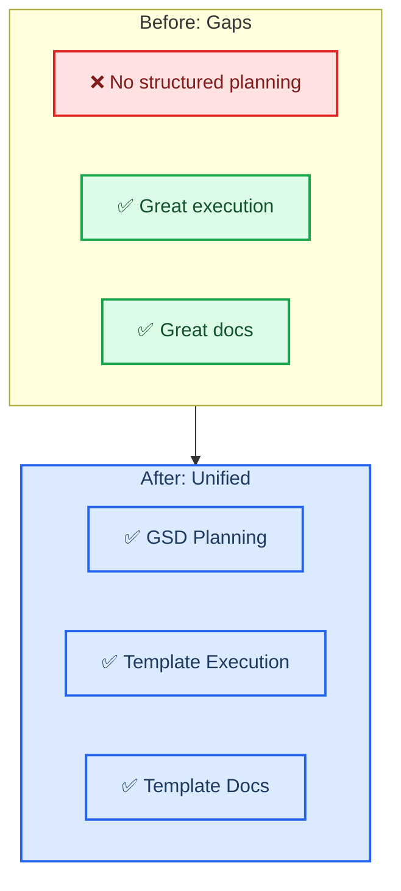
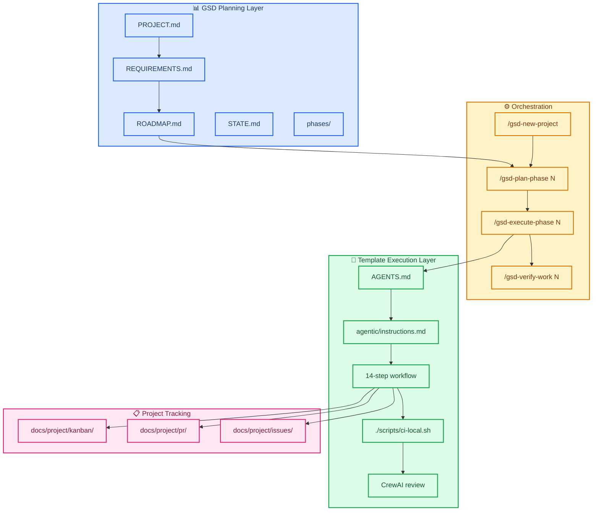
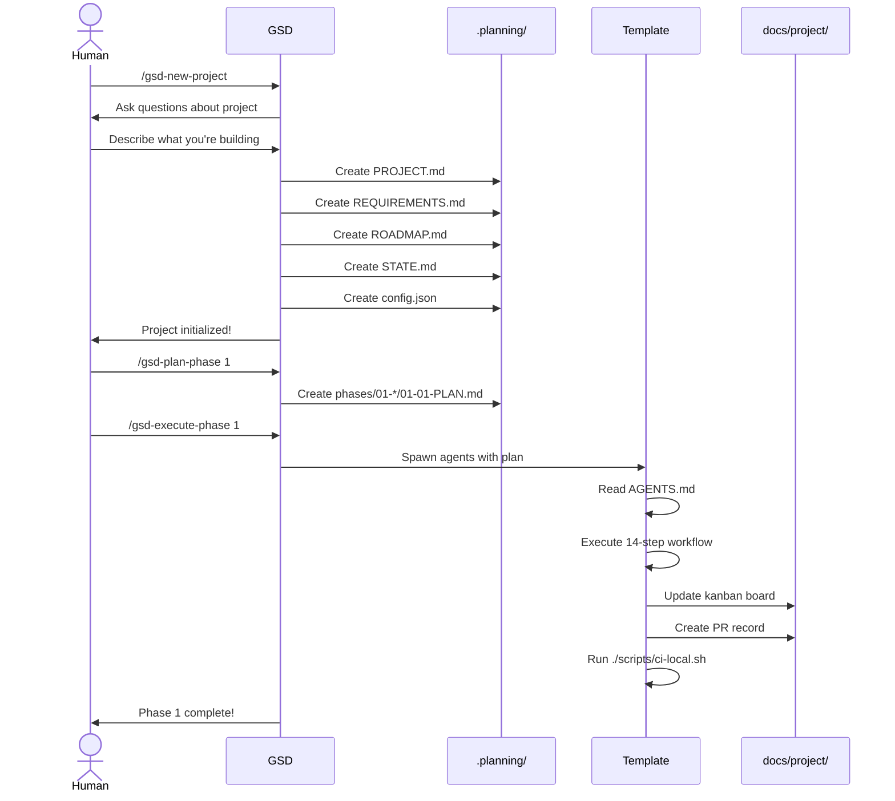
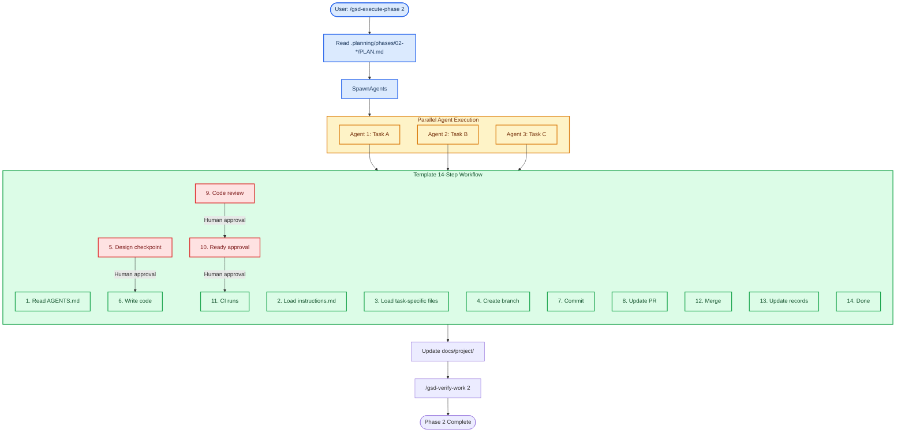
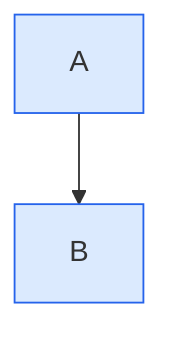

# GSD + Agent-Project Template Integration Guide

**Version:** 1.0  
**Date:** 2026-02-19  
**Status:** Production Ready

---

## 🚀 Quick Start

Already familiar with both systems? Here's the 30-second version:

```bash
# 1. GSD creates the planning layer
/gsd-new-project

# 2. GSD plans each phase
/gsd-plan-phase 1

# 3. GSD executes via template agents
/gsd-execute-phase 1
#    → Agents read AGENTS.md
#    → Follow 14-step workflow
#    → Update docs/project/ tracking
#    → Run ./scripts/ci-local.sh

# 4. Track in kanban (with GSD phase reference)
# 5. Verify completion
/gsd-verify-work 1
```

**That's it.** GSD orchestrates, template executes, you ship.

---

## 📖 Overview

This integration combines two powerful systems:

- **GSD (Get Shit Done)** — Hierarchical project planning and phase-based execution
- **Agent-Project Template** — Rigorous documentation standards and 14-step agent workflow

### What You Get

| Capability       | Before                    | After Integration                      |
| ---------------- | ------------------------- | -------------------------------------- |
| Project Planning | Ad-hoc or external tools  | Structured `.planning/` hierarchy      |
| Execution        | Template 14-step workflow | Same workflow, driven by GSD phases    |
| Tracking         | `docs/project/` files     | Same files, linked to GSD phases       |
| Documentation    | Template standards        | Template standards applied to planning |
| Scale            | Single projects           | Milestones, audits, gap closure        |

### The Integration Philosophy



---

## 🏗️ Architecture

### System Layers



### Directory Structure

```
repository/
├── .planning/                      # GSD planning layer
│   ├── PROJECT.md                  # Project vision
│   ├── REQUIREMENTS.md             # REQ-ID traceability
│   ├── ROADMAP.md                  # Phase breakdown
│   ├── STATE.md                    # Project memory
│   ├── config.json                 # Workflow settings
│   └── phases/                     # Phase-specific plans
│       ├── 01-foundation/
│       │   ├── 01-01-PLAN.md
│       │   └── 01-01-SUMMARY.md
│       └── ...
│
├── agentic/                        # Template framework
│   ├── AGENTS.md                   # Entry point
│   ├── instructions.md             # Agent workflow
│   ├── markdown_style_guide.md     # Doc standards
│   ├── mermaid_style_guide.md      # Diagram standards
│   └── adr/                        # Decision records
│
├── docs/project/                   # Everything-is-code tracking
│   ├── pr/                         # PR records
│   ├── issues/                     # Issue records
│   └── kanban/                     # Sprint boards
│
├── .crewai/                        # Review system
│   ├── config/
│   └── crews/
│
└── scripts/
    └── ci-local.sh                 # Local validation
```

---

## 🔄 Complete Workflow

### Starting a New Project



### Daily Development Flow

**Scenario:** You're mid-project, need to add a feature.

```bash
# Option 1: GSD-managed (recommended for complex work)
/gsd-add-todo "Add user authentication"
/gsd-check-todos
# Select todo, GSD routes to appropriate action
/gsd-plan-phase 3  # If new phase needed
/gsd-execute-phase 3

# Option 2: Quick task (simple changes)
/gsd-quick
# Describe task, GSD executes with lighter process

# Option 3: Template direct (familiar workflow)
# Follow AGENTS.md → instructions.md
# 14-step workflow as usual
```

### Phase Execution Detail



---

## 📋 Command Reference

### GSD Commands with Template Context

| GSD Command            | What It Does               | Template Integration                                  |
| ---------------------- | -------------------------- | ----------------------------------------------------- |
| `/gsd-new-project`     | Initialize planning layer  | Creates `.planning/`, runs questioning flow           |
| `/gsd-plan-phase N`    | Create detailed phase plan | Generates PLAN.md, agents follow template workflow    |
| `/gsd-execute-phase N` | Execute all plans in phase | Spawns parallel agents using template 14-step process |
| `/gsd-verify-work N`   | Validate phase completion  | Runs template CI, checks deliverables                 |
| `/gsd-progress`        | Check project status       | Shows both GSD phases and template tracking           |
| `/gsd-quick`           | Quick ad-hoc task          | Skips research, uses template workflow directly       |
| `/gsd-add-todo`        | Capture task from context  | Links to template issue format                        |
| `/gsd-check-todos`     | Review pending tasks       | Routes to template execution                          |
| `/gsd-map-codebase`    | Analyze existing code      | Creates codebase map for brownfield projects          |

### Template Workflow within GSD

When GSD spawns agents for execution:

1. **Agent reads** `AGENTS.md` (template entrypoint)
2. **Loads** `agentic/instructions.md` (workflow)
3. **Follows** 14-step transparent process
4. **Uses** template style guides for all output
5. **Updates** `docs/project/` tracking files
6. **Runs** `./scripts/ci-local.sh` for validation
7. **Reports** back to GSD for phase verification

---

## 🎯 Best Practices

### 1. Planning Phase Boundaries

**Good:** Phase = logical milestone with clear deliverables

```
Phase 1: Foundation (planning layer setup)
Phase 2: Core Features (auth, profiles)
Phase 3: Social Features (following, likes)
```

**Less Good:** Phase = time period or arbitrary split

```
Phase 1: Week 1 work
Phase 2: Week 2 work
```

### 2. Kanban + GSD Integration

Always include GSD context in kanban boards:

```markdown
**GSD Phase:** 02-alignment — Documentation & Execution Alignment
**Phase Requirements:** DOC-01–04, EXEC-01–02, TRACK-01–03
```

### 3. REQ-ID Traceability

Reference REQ-IDs in PR records:

```markdown
## Requirements Addressed

- ✅ AUTH-01: User can sign up with email
- ✅ AUTH-02: Email verification sent
- 🔄 AUTH-03: Password reset (in progress)
```

### 4. Mermaid Standards

Always use template Mermaid standards (not GSD's minimal approach):

````markdown

````

````

### 5. Commit Messages

Use scoped conventional commits for both planning and implementation:

```bash
# Planning docs
docs: add phase 2 plan for authentication

# Implementation
feat(auth): add email signup endpoint

# Integration point
docs: update kanban with GSD phase 2 progress
````

---

## 📁 File Templates

### Kanban Board with GSD Integration

```markdown
# Sprint WXX YYYY — {Sprint Name}

**GSD Phase:** {NN-phase-name} — {Phase goal}  
**Period:** {YYYY-MM-DD} → {YYYY-MM-DD}

## Visual Board

\`\`\`mermaid
kanban
title {Sprint Name}

Backlog
[Task with REQ-ID reference]

In Progress
[Active work]

Done
[Completed task — REQ-01 complete]
\`\`\`

## Backlog

| #   | Item   | REQ-ID | Notes   |
| --- | ------ | ------ | ------- |
| 1   | {Task} | REQ-01 | {Notes} |

## References

- [GSD ROADMAP](../.planning/ROADMAP.md)
- [GSD STATE](../.planning/STATE.md)
```

### PR Record with Phase Context

```markdown
# PR-{NNNNNNNN}: {Description}

**GSD Phase:** {N} — {Phase name}  
**Requirements:** {REQ-01, REQ-02}

## What Changed

{Description}

## Requirements Addressed

- [x] **REQ-01**: {Description}
- [x] **REQ-02**: {Description}

## Verification

- [x] `./scripts/ci-local.sh` passes
- [x] Code review complete
- [x] Documentation updated

## Related

- [Phase Plan](../../.planning/phases/NN-*/NN-YY-PLAN.md)
```

---

## 🔧 Configuration

### `.planning/config.json`

```json
{
  "mode": "yolo", // or "interactive"
  "depth": "standard", // "quick" | "standard" | "comprehensive"
  "parallelization": true,
  "commit_docs": true,
  "model_profile": "balanced",
  "workflow": {
    "research": true, // Spawn researchers before planning
    "plan_check": true, // Verify plans achieve goals
    "verifier": true, // Verify phase completion
    "auto_advance": true // Auto-proceed in YOLO mode
  }
}
```

**Recommendation for template users:**

- `mode: "yolo"` — You've got template checkpoints for safety
- `commit_docs: true` — Everything-is-code principle
- `workflow.research: true` — Complex domains benefit from research

---

## 🐛 Troubleshooting

### GSD and template conventions conflict

**Issue:** GSD wants to create docs one way, template has standards.

**Solution:** Template standards win. Update GSD output to match template conventions. This guide ensures alignment.

### Can't find planning files

**Check:** `.planning/` directory exists at repo root
**Check:** Files have `.md` extension
**Check:** You're on the right branch

### CI fails on planning files

**Issue:** `./scripts/ci-local.sh` fails on `.planning/` markdown.

**Solution:** Planning files should follow same standards as `docs/`. Run local CI on them:

```bash
./scripts/ci-local.sh --step link-check
```

### Lost track of GSD phase

**Check:** `.planning/STATE.md` — shows current phase and progress
**Check:** `.planning/ROADMAP.md` — shows all phases
**Check:** `docs/project/kanban/` — sprint board references phase

### Agents not following template workflow

**Cause:** GSD agents spawned without AGENTS.md context.

**Solution:** Ensure `/gsd-execute-phase` properly passes template context to spawned agents. Agents should read AGENTS.md first.

---

## 📚 Further Reading

### GSD Documentation

- GSD Command Reference (run `/gsd-help`)
- [`.planning/PROJECT.md`](.planning/PROJECT.md) — This project's context
- [`.planning/ROADMAP.md`](.planning/ROADMAP.md) — Phase breakdown

### Template Documentation

- [`AGENTS.md`](AGENTS.md) — Agent entrypoint
- [`agentic/instructions.md`](agentic/instructions.md) — 14-step workflow
- [`agentic/markdown_style_guide.md`](agentic/markdown_style_guide.md) — Doc standards
- [`agentic/mermaid_style_guide.md`](agentic/mermaid_style_guide.md) — Diagram standards

### Architecture Decisions

- [`agentic/adr/ADR-009-gsd-integration-orchestration-layer.md`](agentic/adr/ADR-009-gsd-integration-orchestration-layer.md) — Integration architecture

---

## ✅ Checklist: Integration Complete

Use this to verify your integration is working:

- [ ] `.planning/` directory exists with core files
- [ ] GSD commands work (`/gsd-progress` shows status)
- [ ] Kanban board references GSD phase
- [ ] PR records include REQ-IDs
- [ ] `./scripts/ci-local.sh` passes
- [ ] Mermaid diagrams use template standards
- [ ] Agents follow 14-step workflow
- [ ] Documentation follows style guides

---

## 🎉 Summary

**You now have:**

1. **GSD's planning power** — hierarchical PROJECT → REQUIREMENTS → ROADMAP
2. **Template's execution rigor** — 14-step workflow with human checkpoints
3. **Unified tracking** — everything-is-code in `docs/project/`
4. **Best-practice documentation** — Mermaid standards, markdown style
5. **Scalable architecture** — milestones, audits, phase-based delivery

**The integration is seamless because:**

- GSD fills the planning gap the template had
- Template provides the execution layer GSD delegates to
- Both use file-based, versioned artifacts
- Both prioritize transparency and quality

**Now go build something amazing.**

---

_Created: 2026-02-19_  
_Version: 1.0_  
_Status: Production Ready_
