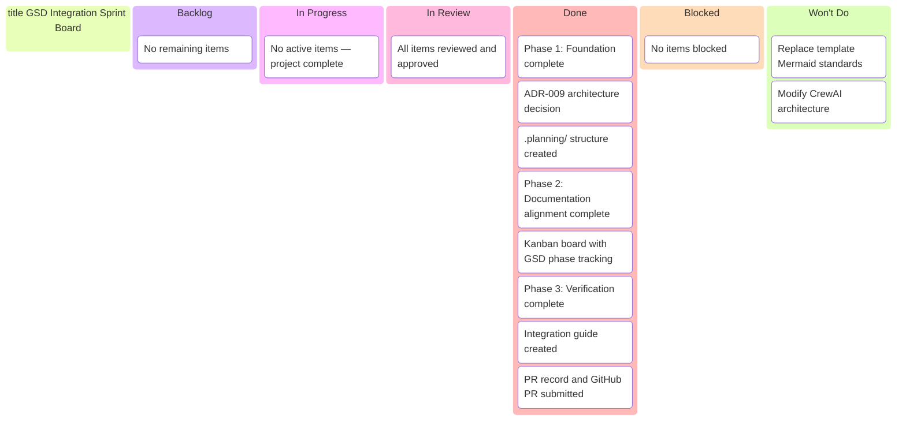
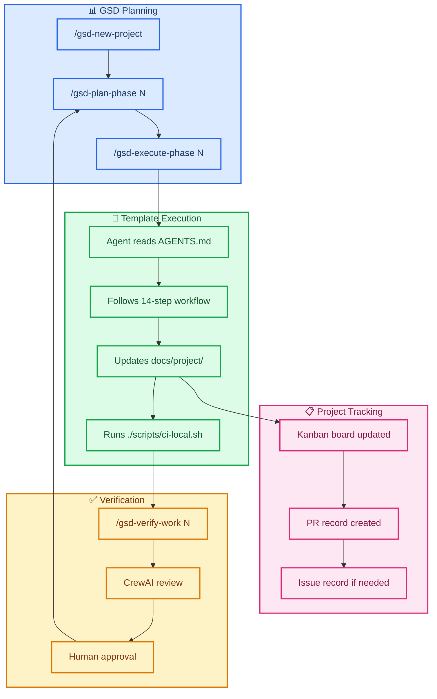

# Sprint W08 2026 — GSD Integration

_Sprint W08: Feb 15-21, 2026 · GSD Integration Track_  
**Final GSD Phase:** 03-verification — Verification & Guide Creation ✅ COMPLETE

> 🎯 **Current status:** ✅ **PROJECT COMPLETE** — All 3 phases finished, 21/21 requirements complete, integration guide ready.

---

## 📋 Board Overview

**Period:** 2026-02-15 → 2026-02-21  
**Goal:** Complete documentation alignment between GSD and template, demonstrate execution layer integration  
**WIP Limit:** 3 items In Progress

### Visual Board

---

## 🚦 Board Status

| Column             | Count | WIP Limit | Status                |
| ------------------ | ----- | --------- | --------------------- |
| 📋 **Backlog**     | 0     | —         | All work complete     |
| 🔄 **In Progress** | 0     | 3         | ✅ Project finished   |
| 🔍 **In Review**   | 0     | —         | All approved          |
| ✅ **Done**        | 8     | —         | All 3 phases complete |
| 🚫 **Blocked**     | 0     | —         | Clear                 |
| 🚫 **Won't Do**    | 2     | —         | Explicit exclusions   |

---

## 🧭 Execution Map

_Integration workflow showing how GSD phases drive template execution:_

---

## 📋 Backlog

_All items complete. No remaining work._

| #   | Item | Priority | REQ-ID | Notes |
| --- | ---- | -------- | ------ | ----- |
| —   | —    | —        | —      | —     |

---

## 🔄 In Progress

_No active items — all work moved to Done._

| Item | Assignee | Started | Expected | Status |
| ---- | -------- | ------- | -------- | ------ |
| —    | —        | —       | —        | —      |

---

## 🔍 In Review

_All items reviewed and approved._

| Item | Author | Reviewer | Status |
| ---- | ------ | -------- | ------ |
| —    | —      | —        | —      |

---

## ✅ Done

| Item                                                  | Assignee | Completed | REQ-ID                   |
| ----------------------------------------------------- | -------- | --------- | ------------------------ |
| Phase 1: Foundation & Planning complete               | AI       | Feb 19    | PLAN-01–05               |
| ADR-009: Integration architecture decision            | AI       | Feb 19    | VERIFY-04                |
| .planning/ structure with all files                   | AI       | Feb 19    | PLAN-01                  |
| Phase 2: Documentation & Execution Alignment complete | AI       | Feb 19    | DOC-01–04, EXEC-01–02    |
| Kanban board with GSD phase reference created         | AI       | Feb 19    | TRACK-01                 |
| Phase 3: Verification & Guide Creation complete       | AI       | Feb 19    | EXEC-03–04, VERIFY-01–02 |
| Comprehensive integration guide created               | AI       | Feb 19    | VERIFY-02                |
| GitHub PR #2 submitted and ready for review           | AI       | Feb 19    | TRACK-02                 |

---

## 🚫 Blocked

_No blocked items._

---

## 🚫 Won't Do

| Item                               | Rationale                                                | Decision Date |
| ---------------------------------- | -------------------------------------------------------- | ------------- |
| Replace template Mermaid standards | Template has 23 diagram guides; superior to GSD defaults | 2026-02-19    |
| Modify CrewAI architecture         | Integration at orchestration layer only                  | 2026-02-19    |

---

## 📊 Metrics

| Metric                    | Value | Target | Status      |
| ------------------------- | ----- | ------ | ----------- |
| **Phase 1 completion**    | 100%  | 100%   | ✅ Complete |
| **Phase 2 completion**    | 100%  | 100%   | ✅ Complete |
| **Phase 3 completion**    | 100%  | 100%   | ✅ Complete |
| **Requirements complete** | 21/21 | 21/21  | ✅ Complete |
| **Blocked items**         | 0     | 0      | ✅ Clear    |
| **PR submitted**          | #2    | —      | ✅ Done     |

---

## 📝 Board Notes

### Decisions This Period

- **Feb 19:** Phase 1 foundation complete — all planning artifacts committed
- **Feb 19:** Kanban board structure demonstrates GSD phase tracking
- **Feb 19:** Template Mermaid standards confirmed as authoritative
- **Feb 19:** Phase 2 alignment complete — documentation standards aligned
- **Feb 19:** Phase 3 verification complete — integration guide created
- **Feb 19:** GitHub PR #2 submitted — <https://github.com/SuperiorByteWorks-LLC/agent-project/pull/2>

### GSD Phase Context

**Status:** ✅ **ALL PHASES COMPLETE**  
**Final Phase:** 03-verification — Verification & Guide Creation  
**Total Requirements:** 21/21 complete (100%)  
**GitHub PR:** #2 ready for review

---

## 🔗 References

- [GSD ROADMAP](../../.planning/ROADMAP.md)
- [GSD STATE](../../.planning/STATE.md)
- [ADR-009 Integration Architecture](../../agentic/adr/ADR-009-gsd-integration-orchestration-layer.md)
- [Phase 1 Summary](../../.planning/phases/01-foundation/01-01-SUMMARY.md)

---

## 🎉 Sprint Complete

**All work finished successfully.**

### Deliverables

| Deliverable           | Location                                                      | Status       |
| --------------------- | ------------------------------------------------------------- | ------------ |
| GSD Planning Layer    | `.planning/`                                                  | ✅ Complete  |
| Architecture Decision | `agentic/adr/ADR-009-gsd-integration-orchestration-layer.md`  | ✅ Complete  |
| Integration Guide     | `docs/project/GSD_INTEGRATION_GUIDE.md`                       | ✅ Complete  |
| PR Record             | `docs/project/pr/pr-00000002-gsd-integration.md`              | ✅ Complete  |
| GitHub PR             | <https://github.com/SuperiorByteWorks-LLC/agent-project/pull/2> | ✅ Submitted |

### Next Sprint

No follow-up sprint required. Project complete.

---

_Board owner: AI Agent_
_Last updated: 2026-02-19 — All phases complete, PR #2 submitted_
