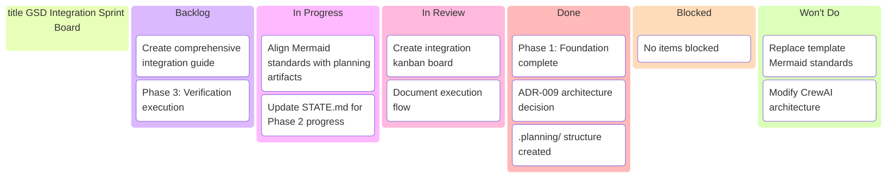
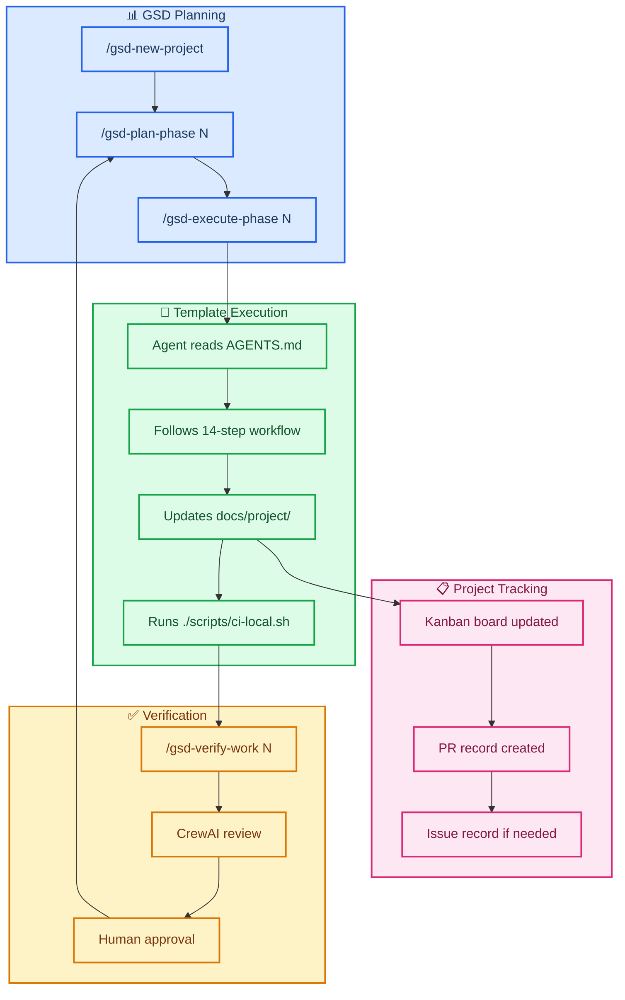

# Sprint W08 2026 — GSD Integration

_Sprint W08: Feb 15-21, 2026 · GSD Integration Track_  
**GSD Phase:** 02-alignment — Documentation & Execution Alignment

> 🎯 **Current status:** Phase 1 complete. Phase 2 in progress — aligning documentation standards and execution layers.

---

## 📋 Board Overview

**Period:** 2026-02-15 → 2026-02-21  
**Goal:** Complete documentation alignment between GSD and template, demonstrate execution layer integration  
**WIP Limit:** 3 items In Progress

### Visual Board

---

## 🚦 Board Status

| Column             | Count | WIP Limit | Status                |
| ------------------ | ----- | --------- | --------------------- |
| 📋 **Backlog**     | 2     | —         | Ready to pull         |
| 🔄 **In Progress** | 2     | 3         | 🟢 Under limit        |
| 🔍 **In Review**   | 2     | —         | Awaiting verification |
| ✅ **Done**        | 3     | —         | Phase 1 complete      |
| 🚫 **Blocked**     | 0     | —         | Clear                 |
| 🚫 **Won't Do**    | 2     | —         | Explicit exclusions   |

---

## 🧭 Execution Map

_Integration workflow showing how GSD phases drive template execution:_

---

## 📋 Backlog

| #   | Item                                   | Priority | REQ-ID    | Notes                         |
| --- | -------------------------------------- | -------- | --------- | ----------------------------- |
| 1   | Create comprehensive integration guide | 🔴 High  | VERIFY-02 | Final deliverable for Phase 3 |
| 2   | Execute Phase 3 verification           | 🔴 High  | VERIFY-01 | End-to-end integration test   |

---

## 🔄 In Progress

| Item                                            | Assignee | Started | Expected | Status         |
| ----------------------------------------------- | -------- | ------- | -------- | -------------- |
| Align Mermaid standards with planning artifacts | AI       | Feb 19  | Feb 19   | 🟡 In progress |
| Update STATE.md for Phase 2 progress            | AI       | Feb 19  | Feb 19   | 🟡 In progress |

---

## 🔍 In Review

| Item                            | Author | Reviewer | Status      |
| ------------------------------- | ------ | -------- | ----------- |
| Create integration kanban board | AI     | Self     | ✅ Complete |
| Document execution flow         | AI     | Self     | ✅ Complete |

---

## ✅ Done

| Item                                    | Assignee | Completed | REQ-ID     |
| --------------------------------------- | -------- | --------- | ---------- |
| Phase 1: Foundation & Planning complete | AI       | Feb 19    | PLAN-01–05 |
| ADR-009: Integration architecture       | AI       | Feb 19    | VERIFY-04  |
| .planning/ structure with all files     | AI       | Feb 19    | PLAN-01    |

---

## 🚫 Blocked

_No blocked items._

---

## 🚫 Won't Do

| Item                               | Rationale                                                | Decision Date |
| ---------------------------------- | -------------------------------------------------------- | ------------- |
| Replace template Mermaid standards | Template has 23 diagram guides; superior to GSD defaults | 2026-02-19    |
| Modify CrewAI architecture         | Integration at orchestration layer only                  | 2026-02-19    |

---

## 📊 Metrics

| Metric                    | Value | Target |
| ------------------------- | ----- | ------ |
| **Phase 1 completion**    | 100%  | 100%   |
| **Phase 2 progress**      | 50%   | —      |
| **Requirements complete** | 7/21  | 21/21  |
| **Blocked items**         | 0     | 0      |

---

## 📝 Board Notes

### Decisions This Period

- **Feb 19:** Phase 1 foundation complete — all planning artifacts committed
- **Feb 19:** Kanban board structure demonstrates GSD phase tracking
- **Feb 19:** Template Mermaid standards confirmed as authoritative

### GSD Phase Context

**Active Phase:** 02-alignment — Documentation & Execution Alignment  
**Phase Goal:** Align documentation standards and connect execution layers  
**Phase Requirements:** DOC-01–04, EXEC-01–02, TRACK-01–03 (9 total)

---

## 🔗 References

- [GSD ROADMAP](../../.planning/ROADMAP.md)
- [GSD STATE](../../.planning/STATE.md)
- [ADR-009 Integration Architecture](../../agentic/adr/ADR-009-gsd-integration-orchestration-layer.md)
- [Phase 1 Summary](../../.planning/phases/01-foundation/01-01-SUMMARY.md)

---

_Board owner: AI Agent_  
_Last updated: 2026-02-19_
