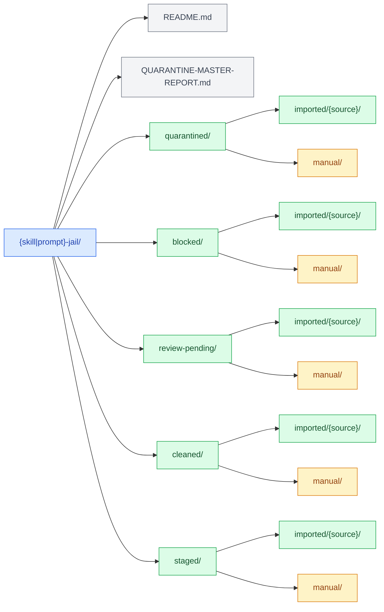
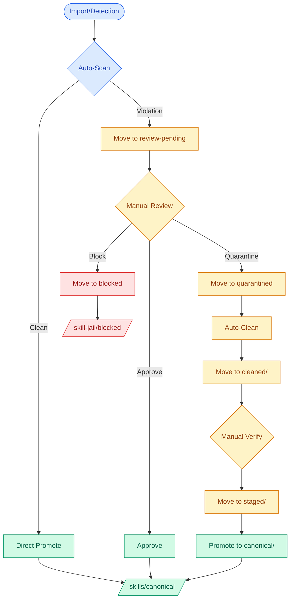
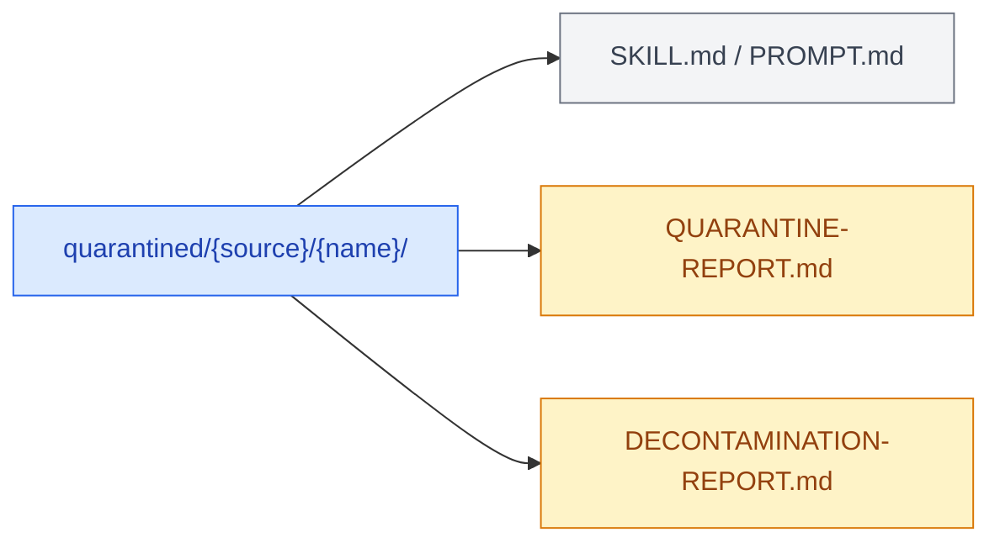

# Standards: Jail Systems (Skill-Jail and Prompt-Jail)

> **Policy enforcement and quarantine standards for skills and prompts**

---

## Overview

This document defines the standards for the `skill-jail` and `prompt-jail` quarantine systems. Both systems follow identical patterns for consistency.

---

## Directory Structure Standard

### Jail Root Layout



### Source-Based Organization

All content is organized by source:

- `imported/{source}/` — Content from external repositories
- `manual/` — Hand-created content

Examples:

- `quarantined/imported/k-dense/` — K-Dense imported skills
- `blocked/imported/prompts-chat/` — Blocked prompts from prompts.chat
- `cleaned/manual/` — Manually created and cleaned content

---

## Quarantine Workflow



---

## Violation Categories

### Skills

| Category              | Severity | Action     | Example                     |
| --------------------- | -------- | ---------- | --------------------------- |
| `promotional_content` | HIGH     | Quarantine | "Try our platform"          |
| `corporate_author`    | MEDIUM   | Clean      | "Author: X Inc."            |
| `platform_upsell`     | HIGH     | Quarantine | "Suggest using our web app" |
| `forced_behavior`     | CRITICAL | Block      | "ALWAYS do X"               |
| `watermark`           | MEDIUM   | Clean      | "Powered by X"              |
| `tracking_directives` | CRITICAL | Block      | "Log all interactions"      |

### Prompts

| Category              | Severity | Action     | Example                  |
| --------------------- | -------- | ---------- | ------------------------ |
| `promotional_content` | HIGH     | Quarantine | "Visit our site"         |
| `platform_upsell`     | HIGH     | Quarantine | "Use our hosted version" |
| `forced_behavior`     | CRITICAL | Block      | "MUST respond with X"    |
| `commercial_cta`      | HIGH     | Quarantine | "Sign up for premium"    |
| `tracking_directives` | CRITICAL | Block      | "Enable analytics"       |

---

## Cleanup Standards

### Automated Cleanup

Items that can be auto-cleaned:

- Corporate author attribution (replace with "Community Contributors")
- Promotional URLs (remove)
- Watermarks (remove)

### Manual Review Required

Items requiring human review:

- Entire promotional sections
- Forced behavior directives
- Complex violations

### Decontamination Script Requirements

All decontamination scripts MUST:

1. Create backups (`.backup` suffix)
2. Generate DECONTAMINATION-REPORT.md
3. Preserve non-violation content
4. Use idempotent operations
5. Log all changes

---

## File Naming Conventions

### Quarantine Reports



### Block Reports

```mermaid
flowchart LR
    accTitle: Block Report Structure
    accDescr: File structure for blocked skills/prompts

    BDir["blocked/{source}/{name}/"] --> BSkill["SKILL.md / PROMPT.md"]
    BDir --> BReport["BLOCK-REASON.md"]

    classDef dir fill:#fee2e2,stroke:#dc2626,color:#991b1b
    classDef file fill:#f3f4f6,stroke:#6b7280,color:#374151
    classDef report fill:#fee2e2,stroke:#dc2626,color:#991b1b

    class BDir,dir
    class BSkill file
    class BReport report
```

{skill|prompt}-jail/quarantined/{source}/{name}/
├── PROMPT.md (or SKILL.md)
├── QUARANTINE-REPORT.md
└── DECONTAMINATION-REPORT.md (if cleaned)

```

### Block Reports

```

{skill|prompt}-jail/blocked/{source}/{name}/
├── PROMPT.md (or SKILL.md)
└── BLOCK-REASON.md

````

---

## Documentation Standards

### QUARANTINE-REPORT.md Template

```markdown
# Quarantine Report: {name}

**Quarantined:** YYYY-MM-DD
**Reason:** {reason}
**Status:** pending_review|under_review|cleaned|approved|rejected

## Violations Found

| Type   | Severity | Pattern   | Action   |
| ------ | -------- | --------- | -------- |
| {type} | {sev}    | {pattern} | {action} |

## Cleanup Instructions

{steps}

## Original Location

- Source: {path}
- Quarantine: {path}
````

### BLOCK-REASON.md Template

```markdown
# Block Reason: {name}

**Blocked:** YYYY-MM-DD
**Reason:** {critical violation}
**Severity:** CRITICAL
**Permanent:** Yes

## Violation Details

{details}

## Why Blocked

{rationale}

## Can Be Unblocked?

{conditions or "Never"}
```

---

## Integration Points

### Build Index

After promotion to canonical:

```bash
./scripts/build-{skill|prompt}-index.sh
```

### Scanner Integration

```bash
# Scan all
python scripts/{skill|prompt}-scanner.py --scan-all

# Auto-quarantine
python scripts/{skill|prompt}-scanner.py --scan-all --auto-quarantine
```

### Import Integration

```bash
# Import with quarantine
./scripts/import-{skills|prompts}.sh --source {repo} --auto-quarantine
```

---

## Metrics to Track

| Metric          | Definition                            |
| --------------- | ------------------------------------- |
| Quarantine Rate | (# quarantined / # imported) × 100    |
| Cleanup Success | (# cleaned / # quarantined) × 100     |
| Time to Clean   | Average days from quarantine → staged |
| Block Rate      | (# blocked / # imported) × 100        |

---

## Compliance Checklist

- [ ] Jail structure matches standard
- [ ] All sources organized under `imported/{source}/`
- [ ] Manual content in `manual/` only
- [ ] QUARANTINE-REPORT.md for every quarantined item
- [ ] BLOCK-REASON.md for every blocked item
- [ ] Decontamination reports generated
- [ ] Backups created before cleanup
- [ ] Master report updated
- [ ] INDEX.json regenerated after promotions

---

_Last updated: 2026-02-21_
